# Multi-Tenant SaaS Booking Platform — Architecture & Implementation Plan

Status: **Draft for approval — no implementation code written yet**
Repository state at time of writing: empty (`main` has zero commits, zero tracked files). Nothing to preserve or migrate.

> **Superseded in places by [DATABASE.md](./DATABASE.md).** The database design task resolved three of the open decisions below and changed two designs: the customer identity model (§16.4), resources in v1 (§16.6), and the promotion rule representation (§10.2). Those sections carry inline notes; `DATABASE.md` is authoritative where they disagree.

---

## 0. Scope and guiding constraints

| Constraint | Decision |
|---|---|
| Tenancy | Many independent companies, each with many branches. Tenant = **Company**. Branch is a sub-scope, never a tenant. |
| Deployment shape | **Modular monolith** on the backend (one deployable, hard module boundaries), not microservices. |
| Business logic location | Backend domain layer only. The frontend renders and validates for UX; it never decides price, availability, or permission. |
| Data | One PostgreSQL database, shared schema, `company_id` everywhere, enforced by Row-Level Security. |
| Async work | Redis + BullMQ, run in a **separate worker process** from the API. |
| Rewrite avoidance | Tenant scoping, money handling, time handling, and entitlements are designed in from commit 1 — these are the four things that cannot be retrofitted cheaply. |

---

## 1. System architecture

### 1.1 Runtime topology

```
                 ┌───────────────────────── Public internet ─────────────────────────┐
                 │                                                                   │
   custom domains / *.booking.app                    app.<platform>.com     admin.<platform>.com
                 │                                            │                      │
        ┌────────▼─────────┐                        ┌─────────▼────────┐   ┌─────────▼────────┐
        │ apps/booking     │                        │ apps/dashboard   │   │ apps/platform    │
        │ Next.js (public) │                        │ Next.js (tenant) │   │ Next.js (admin)  │
        │ SSR/ISR, branded │                        │ authenticated    │   │ MFA-only         │
        └────────┬─────────┘                        └─────────┬────────┘   └─────────┬────────┘
                 └──────────────────┬─────────────────────────┴──────────────────────┘
                                    │  HTTPS, typed client generated from OpenAPI
                          ┌─────────▼──────────┐
                          │ apps/api (NestJS)  │  stateless, N replicas
                          │  HTTP + webhooks   │
                          └───┬────────────┬───┘
                              │            │  enqueue
              ┌───────────────▼──┐   ┌─────▼───────────────┐
              │ PostgreSQL       │   │ Redis               │
              │ RLS enforced     │   │ cache + BullMQ      │
              │ pgBouncer (txn)  │   └─────┬───────────────┘
              └───────────────▲──┘         │ consume
                              │      ┌─────▼───────────────┐
                              └──────┤ apps/worker (Nest)  │  notifications, outbox,
                                     │ same codebase       │  reports, dunning, sweeps
                                     └─────┬───────────────┘
                                           │
                                  S3-compatible object storage (logos, exports, receipts)
                                  Providers: payment gateway, email, SMS/push
```

Three Next.js apps rather than one, because their security postures and caching strategies genuinely differ: the booking site is public, multi-domain, and aggressively cached; the dashboard is authenticated and uncached; the platform console must be isolated and MFA-gated. If team size forces it, `dashboard` and `platform` can start as one app with separate route groups — but `booking` should be separate from day one because of custom-domain routing.

### 1.2 Backend layering (inside the monolith)

```
Interface layer   Controllers, DTOs, guards, OpenAPI, webhook endpoints, BullMQ processors
      │           (knows HTTP/queue; knows nothing about Prisma)
Application layer Use cases / command handlers. Orchestration, transactions, authorization
      │           policy invocation, event publication via outbox.
Domain layer      Pure TypeScript. Entities, value objects, invariants, state machines,
      │           AvailabilityEngine, DiscountEngine, LedgerRules. Zero I/O, fully unit-testable.
Infrastructure    Prisma repositories, Redis adapters, payment gateway adapters, mail/SMS
                  adapters, object storage, clock. All behind ports (interfaces) owned by the
                  application layer.
```

The rule that matters: **the domain layer must be runnable in a unit test with no database and no clock.** Availability and pricing are the two places where teams normally leak I/O into logic and then cannot test edge cases. Injecting `Clock` and `IdGenerator` is not ceremony here; it is what makes DST and concurrency testable.

### 1.3 Cross-cutting concerns

- **Tenant context** — `AsyncLocalStorage` holds `{ companyId, branchIds, actor, requestId, permissions }` for the whole request/job. Every repository reads it; nothing accepts `companyId` as an optional parameter.
- **Outbox** — domain events are written to an `outbox_event` row in the *same transaction* as the state change; a worker publishes them. No `await notify()` inside a booking transaction.
- **Audit** — privileged actions append to an immutable `audit_log`.
- **Observability** — structured logs with `requestId`/`companyId`, OpenTelemetry traces, per-tenant metrics (bookings/min, availability latency, queue depth).

### 1.4 Repository layout

```
/
├─ apps/
│  ├─ api/          NestJS HTTP entrypoint
│  ├─ worker/       NestJS queue entrypoint (imports the same modules)
│  ├─ booking/      Next.js public booking site
│  ├─ dashboard/    Next.js tenant admin
│  └─ platform/     Next.js platform admin
├─ packages/
│  ├─ domain/       (optional) pure domain if shared with edge/preview logic
│  ├─ contracts/    zod schemas + generated OpenAPI TS client, shared by all frontends
│  ├─ ui/           design system, themable via CSS variables (tenant branding)
│  └─ config/       eslint, tsconfig, tailwind presets
├─ prisma/
│  ├─ schema/       split .prisma files per module (prismaSchemaFolder)
│  └─ migrations/   includes hand-written SQL for RLS, GIST constraints, partitions
├─ docker/          Dockerfiles, compose, pgbouncer conf, seed
└─ docs/            this document, ADRs
```

Tooling: pnpm workspaces + Turborepo. One `prisma` package owned by the backend; frontends never import Prisma types directly — they import from `packages/contracts`.

---

## 2. Module structure

Each backend module owns its tables, exposes a service interface, and publishes domain events. **A module never queries another module's tables directly** — this is the seam that lets a module be extracted into a service later without a rewrite.

| Module | Owns | Publishes | Consumes |
|---|---|---|---|
| `platform` | platform admins, tenant provisioning, impersonation | `CompanyProvisioned` | — |
| `tenancy` | Company, CompanySettings, Branding, CompanyDomain, Branch | `CompanyCreated`, `BranchCreated` | plan entitlements |
| `identity` | User, credentials, sessions, refresh tokens, MFA | `UserRegistered` | — |
| `access` | Role, Permission, Membership, policy evaluation | `RoleChanged` | identity |
| `staff` | Employee, EmployeeBranch, EmployeeService, skills | `EmployeeDeactivated` | identity, tenancy |
| `catalog` | ServiceCategory, Service, BranchServiceOverride, Resource | `ServiceChanged` | tenancy |
| `scheduling` | BusinessHours, BranchClosure, EmployeeSchedule, TimeOff | `ScheduleChanged` | staff, tenancy |
| `availability` | availability engine, materialized day read-model, cache | — | scheduling, booking, catalog |
| `booking` | Appointment, AppointmentItem, StatusHistory, Hold, Waitlist | `AppointmentBooked/Rescheduled/Cancelled/Completed/NoShow` | availability, catalog, pricing, customers |
| `customers` | Customer, contact info, notes, consents, tags | `CustomerCreated` | tenancy |
| `pricing` | price resolution, tax rules, quote assembly | — | catalog, promotions, giftcards |
| `promotions` | Promotion, Coupon, Redemption, discount engine | `CouponRedeemed` | pricing |
| `giftcards` | GiftCard, GiftCardTransaction (ledger) | `GiftCardIssued/Redeemed` | payments |
| `payments` | PaymentIntent, Payment, Refund, LedgerEntry, gateway adapters | `PaymentSucceeded/Failed/Refunded` | booking, giftcards |
| `billing` | Plan, Entitlement, Subscription, UsageRecord, dunning | `SubscriptionStatusChanged` | payments provider |
| `notifications` | Template, Channel adapters, NotificationLog, preferences | `NotificationSent` | all domain events |
| `reporting` | aggregate read models, exports | — | all domain events |
| `audit` | AuditLog | — | all |
| `files` | uploads, signed URLs, virus scan | — | — |
| `integrations` | outbound webhooks, external calendar sync | — | all domain events |

**Shared kernel** (`packages/domain/shared`): `Money`, `Currency`, `TimeRange`, `IntervalSet`, `TenantId`, `Clock`, `Result<T,E>`, `DomainEvent`. Small and stable by construction — if it grows fast, module boundaries are wrong.

### Frontend module structure

Feature-sliced, mirroring backend modules:

```
src/
├─ app/            routes only — layout, loading, error, params → feature components
├─ features/       booking-flow, appointment-calendar, service-catalog, promotions, …
│    └─ <feature>/ api/   (TanStack Query hooks over the generated client)
│                  model/ (view state only — never business rules)
│                  ui/    (components)
├─ entities/       shared display models (AppointmentCard, ServiceChip)
└─ shared/         ui kit, hooks, formatting, tenant theme provider
```

Non-negotiable frontend rules: no price arithmetic, no availability computation, no permission decisions in the client (render-hiding by permission is a UX nicety, the server re-checks). Money is formatted from `{ amountMinor, currency }`, never parsed from a display string.

---

## 3. Multi-tenant strategy

### 3.1 Chosen model: shared database, shared schema, RLS-enforced

| Option | Verdict |
|---|---|
| Database per tenant | Strongest isolation, but migrations, connection pools, and backups scale linearly with tenant count. Reserve for a future Enterprise tier. |
| Schema per tenant | Migration time and Postgres catalog bloat become the bottleneck at a few hundred tenants; cross-tenant reporting becomes painful. Rejected. |
| **Shared schema + `company_id` + RLS** | **Chosen.** Cheapest ops, trivial platform-wide reporting, and RLS provides a database-level guarantee that application bugs cannot bypass. |

### 3.2 Defense in depth (four independent layers)

1. **PostgreSQL RLS** — every tenant table has `ENABLE ROW LEVEL SECURITY` and a policy `USING (company_id = current_setting('app.current_company_id')::uuid)`. This is the hard guarantee.
2. **Prisma client extension** — wraps every operation, injects the tenant filter, and refuses to run any query when no tenant context is set (except for explicitly whitelisted global tables).
3. **Tenant-scoped repository base class** — application code cannot construct an unscoped query without going out of its way.
4. **Automated leakage tests** — a standing test suite seeds two companies and asserts that every endpoint returns 404 (not 403 — do not confirm existence) for the other tenant's IDs.

### 3.3 How the tenant context reaches the database

Two Postgres roles:

- `app_tenant` — RLS enforced. Used by every normal request.
- `app_platform` — `BYPASSRLS`. Separate connection pool, used only by the platform module and by migrations. Every query on this pool is audit-logged.

Per request the API opens a transaction and issues `SET LOCAL app.current_company_id = $1` before any statement. `SET LOCAL` is transaction-scoped, which makes it safe with **transaction-mode** pgBouncer. This is a real constraint to internalize: *session-mode pooling, or a `SET` without `LOCAL`, will leak tenant context across requests.* It also means read paths get wrapped in transactions, which costs a little; measure it, and if it hurts, the escape hatch is a dedicated read path with explicit `company_id` predicates (with RLS still on) against a replica.

### 3.4 Tenant resolution

- Public booking: `Host` header → `company_domain` lookup (cached in Redis) → `companyId`. Supports `slug.booking.app` and verified custom domains.
- Authenticated APIs: `companyId` is a claim in the access token. A path/body `companyId` that disagrees with the token is a 403 and an audit event — never trust the client.
- Users belong to companies through `Membership`; a user with memberships in several companies picks one, and the chosen company is baked into the issued token (switching company = new token).
- Platform admins act through explicit, time-boxed **impersonation grants**: a distinct token type, a visible banner in the UI, full audit trail, and no write access unless the grant says so.

### 3.5 Identifiers

UUIDv7 primary keys everywhere: sortable (good B-tree locality, unlike v4), non-guessable (unlike serial), and safe to expose. Human-facing references (appointment number, invoice number) are a *separate* per-company sequence, because customers will read them aloud on the phone.

---

## 4. Main domain entities

Fields listed are the load-bearing ones, not exhaustive. Every tenant table carries `company_id`, `created_at`, `updated_at`, and (where user-editable) `deleted_at` for soft deletion.

### Tenancy & platform
- **Company** — `id, slug, legalName, displayName, timezone, currency, locale, status(ACTIVE|SUSPENDED|CANCELED), createdAt`
- **CompanyDomain** — `companyId, hostname, isPrimary, verifiedAt, verificationToken, certStatus`
- **CompanyBranding** — `companyId, logoFileId, faviconFileId, primaryColor, accentColor, fontFamily, emailHeaderFileId, customCss(sanitized), bookingPageCopy(jsonb)`
- **CompanySettings** — `bookingLeadTimeMin, maxAdvanceDays, cancellationWindowHours, cancellationFeePolicy, noShowPolicy, slotGranularityMin, requireDeposit, autoConfirm`
- **Branch** — `companyId, name, timezone, address(jsonb), phone, geo, isActive`
- **PlatformAdmin** — `email, roles, mfaEnrolledAt`
- **ImpersonationGrant** — `platformAdminId, companyId, scope, expiresAt, reason, revokedAt`

### Identity & access
- **User** — `email(citext, unique), passwordHash(argon2id), name, phone, emailVerifiedAt, mfaSecret, status, lastLoginAt`
- **Membership** — `userId, companyId, roleId, branchScope(uuid[] | null = all), isOwner, status` — unique `(userId, companyId)`
- **Role** — `companyId(nullable = system role), key, name, isSystem`
- **Permission** — `key`, e.g. `appointment:write`, `report:revenue:read` (static catalog, seeded)
- **RolePermission** — `roleId, permissionKey`
- **RefreshToken** — `userId, tokenHash, familyId, expiresAt, revokedAt, replacedById, ip, userAgent`

### Staff
- **Employee** — `companyId, userId(nullable — not every employee logs in), displayName, title, color, bio, avatarFileId, isBookable, employmentStart/End, status`
- **EmployeeBranch** — `employeeId, branchId, isPrimary`
- **EmployeeService** — `employeeId, serviceId, durationOverrideMin, priceOverrideMinor, proficiency`

### Catalog
- **ServiceCategory** — `companyId, name, sortOrder`
- **Service** — `companyId, categoryId, name, description, durationMin, bufferBeforeMin, bufferAfterMin, priceMinor, currency, taxRateId, capacity(1 = individual, >1 = group class), isOnlineBookable, requiresDeposit, depositMinor, colour, status`
- **BranchServiceOverride** — `branchId, serviceId, priceMinor, durationMin, isAvailable`
- **Resource** / **ResourceType** — `companyId, branchId, name, type(ROOM|CHAIR|EQUIPMENT), capacity` (needed the moment a service occupies a room as well as a person)
- **ServiceResourceRequirement** — `serviceId, resourceTypeId, quantity`

### Scheduling
- **BusinessHours** — `branchId, dayOfWeek, openTime, closeTime, effectiveFrom, effectiveTo` (local wall-clock times)
- **BranchClosure** — `branchId, startAt, endAt, reason` (holidays, one-off closures)
- **EmployeeSchedule** — `employeeId, branchId, recurrenceRule(RRULE) | dayOfWeek, startTime, endTime, effectiveFrom, effectiveTo`
- **EmployeeScheduleException** — `employeeId, date, startTime, endTime, isWorking`
- **TimeOff** — `employeeId, startAt, endAt, type(VACATION|SICK|BREAK), status(PENDING|APPROVED), isPaid`
- **AvailabilityDay** (read model) — `companyId, branchId, employeeId, date, freeIntervals(jsonb), computedAt, version`

### Booking
- **Appointment** (aggregate root) — `companyId, branchId, customerId, number, status, source(ONLINE|WALKIN|PHONE|IMPORT), startAt, endAt, totalMinor, discountMinor, taxMinor, paidMinor, currency, notes, cancellationReason, cancelledAt, holdExpiresAt, rescheduledFromId, version(optimistic lock)`
- **AppointmentItem** — `appointmentId, serviceId, employeeId, startAt, endAt, timeRange(tstzrange, generated), durationMin, unitPriceMinor, discountMinor, taxMinor, snapshot(jsonb: service name, employee name, policy at booking time)`
- **AppointmentResource** — `appointmentItemId, resourceId, timeRange`
- **AppointmentStatusHistory** — `appointmentId, fromStatus, toStatus, actorType, actorId, reason, at`
- **Waitlist** — `companyId, branchId, customerId, serviceId, employeeId(nullable), desiredWindow, status`

### Customers
- **Customer** — `companyId, firstName, lastName, email, phone(E.164), birthDate, gender, tags[], preferredEmployeeId, marketingConsentAt, notes, blockedAt, totalVisits, totalSpentMinor, lastVisitAt` — unique `(companyId, email)` and `(companyId, phone)` where not null
- **CustomerNote** — `customerId, authorId, body, isPrivate`
- **CustomerConsent** — `customerId, type(MARKETING_EMAIL|SMS|DATA_PROCESSING), grantedAt, revokedAt, source`

### Money
- **PaymentIntent** — `companyId, appointmentId(nullable), purpose(APPOINTMENT|DEPOSIT|GIFT_CARD|NO_SHOW_FEE), amountMinor, currency, provider, providerIntentId, status, idempotencyKey(unique), expiresAt`
- **Payment** — `paymentIntentId, amountMinor, method(CARD|CASH|GIFT_CARD|BANK|WALLET), providerChargeId, capturedAt, status, feeMinor, netMinor`
- **Refund** — `paymentId, amountMinor, reason, providerRefundId, status`
- **LedgerEntry** (append-only, double-entry) — `companyId, journalId, account(REVENUE|CASH|GIFT_CARD_LIABILITY|DISCOUNT|TAX|FEES|REFUNDS|TIPS), debitMinor, creditMinor, currency, refType, refId, occurredAt`
- **Invoice** — `companyId, appointmentId, number, issuedAt, lines(jsonb), subtotalMinor, discountMinor, taxMinor, totalMinor, status, pdfFileId`
- **TaxRate** — `companyId, name, ratePpm, isInclusive`

### Promotions
- **Promotion** — `companyId, name, type(PERCENT|FIXED|FREE_SERVICE|BOGO|BUNDLE), value, conditions(jsonb), startAt, endAt, priority, stackable, isAutoApply, maxRedemptions, maxRedemptionsPerCustomer, redeemedCount, status`
- **Coupon** — `promotionId, code (unique per company, uppercased; stored hashed for lookup), maxRedemptions, redeemedCount, issuedToCustomerId(nullable), expiresAt`
- **CouponRedemption** — `couponId, promotionId, customerId, appointmentId, discountMinor, redeemedAt` — unique `(couponId, appointmentId)`

### Gift cards
- **GiftCard** — `companyId, codeHash(unique), codeLast4, pinHash(nullable), initialAmountMinor, balanceMinor, currency, issuedToCustomerId, purchasedByCustomerId, purchasePaymentId, branchRestrictionIds[], serviceRestrictionIds[], issuedAt, expiresAt, status(ACTIVE|DEPLETED|EXPIRED|VOID)`
- **GiftCardTransaction** (append-only) — `giftCardId, type(ISSUE|REDEEM|REFUND|ADJUSTMENT|EXPIRE|VOID), amountMinor, balanceAfterMinor, appointmentId, paymentId, actorId, occurredAt`

### Notifications
- **NotificationTemplate** — `companyId(nullable = platform default), key(APPOINTMENT_CONFIRMED|REMINDER_24H|…), channel(EMAIL|SMS|PUSH|WEBHOOK), locale, subject, body(handlebars), isActive`
- **NotificationPreference** — `companyId, customerId|employeeId, channel, key, enabled`
- **Notification** — `companyId, templateKey, channel, recipient, payload(jsonb), scheduledFor, sentAt, providerMessageId, status, attempts, lastError`

### SaaS billing
- **Plan** — `key, name, priceMinor, currency, interval(MONTH|YEAR), trialDays, isPublic, sortOrder`
- **PlanEntitlement** — `planId, featureKey, limitValue(int | null = unlimited), isBoolean`
- **Subscription** — `companyId, planId, status(TRIALING|ACTIVE|PAST_DUE|GRACE|SUSPENDED|CANCELED), quantity, currentPeriodStart/End, trialEndsAt, cancelAtPeriodEnd, providerSubscriptionId`
- **SubscriptionInvoice** — `subscriptionId, providerInvoiceId, amountMinor, status, periodStart/End, paidAt, attemptCount`
- **UsageRecord** — `companyId, metric(SMS_SENT|BOOKINGS|STORAGE_MB), quantity, occurredAt, periodKey`
- **EntitlementOverride** — `companyId, featureKey, limitValue, reason, expiresAt` (for bespoke enterprise deals — without this you will end up hardcoding customer names)

### Infrastructure tables
- **OutboxEvent** — `id, companyId, type, payload(jsonb), occurredAt, publishedAt, attempts`
- **AuditLog** — `companyId(nullable), actorType, actorId, action, resourceType, resourceId, before(jsonb), after(jsonb), ip, userAgent, at`
- **WebhookEndpoint** / **WebhookDelivery**
- **File** — `companyId, key, mime, sizeBytes, checksum, scanStatus, uploadedBy`
- **IdempotencyKey** — `companyId, key, endpoint, requestHash, responseBody, statusCode, expiresAt`

---

## 5. Entity relationships

```mermaid
erDiagram
    COMPANY ||--o{ BRANCH : has
    COMPANY ||--o{ COMPANY_DOMAIN : "resolves via"
    COMPANY ||--|| COMPANY_BRANDING : styles
    COMPANY ||--|| SUBSCRIPTION : "pays through"
    COMPANY ||--o{ MEMBERSHIP : grants
    COMPANY ||--o{ EMPLOYEE : employs
    COMPANY ||--o{ SERVICE : offers
    COMPANY ||--o{ CUSTOMER : owns
    COMPANY ||--o{ PROMOTION : runs
    COMPANY ||--o{ GIFT_CARD : issues
    COMPANY ||--o{ APPOINTMENT : records

    USER ||--o{ MEMBERSHIP : "member of"
    MEMBERSHIP }o--|| ROLE : assigned
    ROLE ||--o{ ROLE_PERMISSION : includes
    USER |o--o| EMPLOYEE : "may log in as"

    BRANCH ||--o{ BUSINESS_HOURS : "opens per"
    BRANCH ||--o{ BRANCH_CLOSURE : closes
    BRANCH ||--o{ EMPLOYEE_BRANCH : staffs
    BRANCH ||--o{ RESOURCE : contains
    BRANCH ||--o{ APPOINTMENT : hosts

    EMPLOYEE ||--o{ EMPLOYEE_BRANCH : "works at"
    EMPLOYEE ||--o{ EMPLOYEE_SERVICE : "can perform"
    EMPLOYEE ||--o{ EMPLOYEE_SCHEDULE : "works when"
    EMPLOYEE ||--o{ TIME_OFF : "absent when"
    EMPLOYEE ||--o{ APPOINTMENT_ITEM : performs

    SERVICE_CATEGORY ||--o{ SERVICE : groups
    SERVICE ||--o{ EMPLOYEE_SERVICE : "performed by"
    SERVICE ||--o{ BRANCH_SERVICE_OVERRIDE : "priced per branch"
    SERVICE ||--o{ SERVICE_RESOURCE_REQUIREMENT : needs
    SERVICE ||--o{ APPOINTMENT_ITEM : booked_as

    CUSTOMER ||--o{ APPOINTMENT : books
    CUSTOMER ||--o{ CUSTOMER_CONSENT : declares
    CUSTOMER ||--o{ COUPON_REDEMPTION : redeems

    APPOINTMENT ||--|{ APPOINTMENT_ITEM : "consists of"
    APPOINTMENT ||--o{ APPOINTMENT_STATUS_HISTORY : "transitions through"
    APPOINTMENT ||--o{ PAYMENT_INTENT : "settled by"
    APPOINTMENT ||--o| INVOICE : "invoiced as"
    APPOINTMENT ||--o{ COUPON_REDEMPTION : "discounted by"
    APPOINTMENT_ITEM ||--o{ APPOINTMENT_RESOURCE : occupies

    PAYMENT_INTENT ||--o{ PAYMENT : captures
    PAYMENT ||--o{ REFUND : "refunded by"
    PAYMENT ||--o{ LEDGER_ENTRY : posts
    PAYMENT |o--o| GIFT_CARD_TRANSACTION : "tendered by"

    PROMOTION ||--o{ COUPON : "issues codes"
    COUPON ||--o{ COUPON_REDEMPTION : used_in

    GIFT_CARD ||--|{ GIFT_CARD_TRANSACTION : "balance from"

    PLAN ||--o{ PLAN_ENTITLEMENT : defines
    PLAN ||--o{ SUBSCRIPTION : "subscribed as"
    SUBSCRIPTION ||--o{ SUBSCRIPTION_INVOICE : billed
    COMPANY ||--o{ USAGE_RECORD : meters
```



### Relationship rules worth stating explicitly

1. **Every arrow above stays inside one company.** A foreign key that could cross tenants (e.g. `appointment.customer_id`) is protected by a composite FK on `(company_id, id)` — not just `(id)`. This makes cross-tenant references impossible at the database level, not merely unlikely.
2. **Employee ⟂ User.** An employee who never logs in has no `User`. A user who is an owner but performs no services has no `Employee`. Conflating them is the most common early mistake and is expensive to undo.
3. **Customer is per-company.** The same human booking at two companies is two `Customer` rows. This is correct for data isolation and privacy law; a future optional `Person` identity can link them for a consumer-facing "my bookings" app.
4. **Appointment always has items.** Even a single-service booking creates one `AppointmentItem`. Modelling the single-service case specially and adding multi-service later means rewriting availability, pricing, and reporting.
5. **Prices and durations are snapshotted** onto `AppointmentItem`. Changing a service price must never alter historical revenue.

---

## 6. Authentication and authorization strategy

### 6.1 Three separate identity realms

| Realm | Who | Credentials | Token audience |
|---|---|---|---|
| Staff | Employees, managers, owners | Email + password (argon2id), optional TOTP; MFA mandatory for Owner | `aud: staff`, claims `{ sub, companyId, membershipId, roleKey, branchScope, perms }` |
| Customer | End consumers booking | Passwordless preferred: email magic link or SMS OTP; optional password | `aud: customer`, claims `{ sub, companyId }` |
| Platform | Platform operators | Email + password + **mandatory** MFA, optional IP allowlist | `aud: platform`, claims `{ sub, platformRoles }` |

Tokens from one realm are rejected by the others' guards. This is cheap now and prevents a whole class of privilege-escalation bugs.

### 6.2 Token mechanics

- Access token: JWT, **10–15 minutes**, signed with a rotating asymmetric key (JWKS endpoint), never stored in `localStorage`.
- Refresh token: opaque random 256-bit, stored **hashed** in Postgres with a `familyId`. Rotation on every use; **reuse of a rotated token revokes the entire family** and raises a security event. Delivered as `HttpOnly; Secure; SameSite=Lax` cookie scoped to the API origin.
- Revocation: a Redis deny-list keyed by `jti`/`sessionId`, populated on logout, role change, employee deactivation, and company suspension. Short access-token lifetime keeps the list small.
- Company switching issues a new token; a token is valid for exactly one company.

### 6.3 Authorization model — RBAC core, ABAC edges

Permission keys are static and namespaced: `appointment:read`, `appointment:write`, `appointment:cancel:any`, `customer:read`, `customer:export`, `service:write`, `employee:write`, `schedule:write:any`, `payment:refund`, `promotion:write`, `giftcard:issue`, `giftcard:adjust`, `report:revenue:read`, `settings:billing`, `settings:branding`.

Seeded system roles: `OWNER`, `ADMIN`, `BRANCH_MANAGER`, `RECEPTIONIST`, `EMPLOYEE`, `READ_ONLY`. Companies may clone a system role into a custom role; system roles themselves are immutable.

Three checks run in order, and all three must pass:

1. **Tenant guard** — token `companyId` matches resolved tenant; company status is `ACTIVE` or read-only-grace.
2. **Permission guard** — `@RequirePermission('appointment:cancel:any')` against the role's permission set (cached in Redis per membership, invalidated on `RoleChanged`).
3. **Policy guard (record-level)** — a per-resource policy function. This is where "an employee may read their own appointments but not a colleague's" and "a branch manager may act only within `branchScope`" live. Policies are pure functions `(actor, resource) => boolean`, unit-tested, and also expressible as a query predicate so lists are *filtered* rather than fetched-then-rejected.

Entitlement checks are a fourth, orthogonal gate (`@RequiresFeature('custom_domain')`) — see §12. Keep it separate from permissions: *"are you allowed"* and *"does your plan include it"* are different questions with different responses (403 vs 402).

### 6.4 Public booking endpoints

Unauthenticated but tenant-scoped and hostile-traffic-facing. They get: strict rate limits (per IP, per phone, per company), bot protection (Turnstile) on the submit step, no customer enumeration (looking up a customer by phone must not reveal existence — always return a generic "we'll send a code"), and server-side price computation only.

---

## 7. Appointment architecture

### 7.1 Aggregate and state machine

`Appointment` is the transactional boundary. All invariants (times align, items belong to the branch, employee can perform the service, total equals sum of items) are enforced when the aggregate is saved.

```
                    ┌───────────────────────────────────────────┐
                    ▼                                           │
  HOLD ──► PENDING ──► CONFIRMED ──► CHECKED_IN ──► IN_PROGRESS ──► COMPLETED
   │          │            │              │                            │
   │          │            │              │                            └─► invoice + ledger
   │          ▼            ▼              ▼
   │      CANCELLED    CANCELLED       NO_SHOW
   ▼
 EXPIRED (swept by worker)
```

- `HOLD` — created when a customer selects a slot, carries `holdExpiresAt` (5–10 min). **Occupies the slot for real** (see 7.2) so two customers cannot both proceed to payment for the same slot.
- `PENDING` — awaiting payment or manual approval.
- `CONFIRMED` — the booking exists. Reminders scheduled here.
- Reschedule = cancel-and-create linked by `rescheduledFromId`, not an in-place time mutation. Preserves history and keeps reporting honest.

Transitions live in an `AppointmentStateMachine` in the domain layer; every transition writes `AppointmentStatusHistory` and emits an outbox event.

### 7.2 Double-booking prevention — the part that must be right

Application-level "check then insert" always loses under concurrency. The guarantee is a **database exclusion constraint**:

```sql
CREATE EXTENSION IF NOT EXISTS btree_gist;

ALTER TABLE appointment_item
  ADD CONSTRAINT appointment_item_no_overlap
  EXCLUDE USING gist (
    employee_id WITH =,
    time_range  WITH &&
  ) WHERE (status IN ('HOLD','PENDING','CONFIRMED','CHECKED_IN','IN_PROGRESS'));
```

`time_range` is a generated `tstzrange(start_at, end_at, '[)')` that already includes buffers. An identical constraint guards `appointment_resource` for rooms and equipment. For group services (`capacity > 1`) the exclusion constraint does not apply; those use a counted reservation with `SELECT ... FOR UPDATE` on the session row.

A Redis short-lived lock on `(employeeId, dayKey)` sits in front purely to turn a rare constraint violation into a friendly "someone just took that slot" instead of a 500 — it is an optimization, never the guarantee.

Every booking write also carries an `Idempotency-Key`; a retried POST returns the original response rather than creating a second appointment.

### 7.3 Time handling

- All instants stored as `timestamptz` (UTC). No naive timestamps anywhere.
- Business rules (opening hours, schedules) are stored as **local wall-clock** plus the branch's IANA timezone, and materialized to UTC per date. A salon opens at 09:00 local on the day the clocks change too — storing a fixed UTC offset instead of a timezone breaks twice a year.
- The **branch** timezone, not the company timezone, governs a booking. Multi-timezone companies therefore work for free.
- Every API response carries both the UTC instant and the branch timezone; the frontend formats, and never silently converts to the viewer's local zone without labelling it.

### 7.4 Booking flow

```
1. GET  /public/availability?branch&service&employee?&from&to      → slots (cached, advisory)
2. POST /public/holds        { slot, services[] }                  → holdId, expiresAt
3. POST /public/quotes       { holdId, couponCode?, giftCardCode? } → server-computed breakdown
4. POST /public/appointments { holdId, customer, quoteId, paymentIntentId? }
        └─ single transaction:
             SET LOCAL app.current_company_id
             re-validate availability (the exclusion constraint is the arbiter)
             upsert customer
             promote HOLD → PENDING/CONFIRMED
             consume coupon (conditional UPDATE), debit gift card (ledger row)
             write invoice lines + ledger entries
             write outbox events
5. worker: send confirmation, schedule reminder jobs (24h / 2h before), sync external calendar
```

Payment, when required, happens between steps 3 and 4 against the held slot; the provider webhook confirms it.

---

## 8. Availability engine architecture

### 8.1 The core function is pure

```
availableSlots(request) =
  (  BusinessHours(branch, dateRange)
   ∩ EmployeeWorkingIntervals(employee, dateRange) )
  − BranchClosures
  − ApprovedTimeOff
  − ExistingBusyIntervals (appointments + holds, including buffers)
  − ResourceBusyIntervals (for services needing a room or equipment)
  ⇒ sliceIntoSlots(duration + buffers, granularity, alignment)
  ⇒ filter(leadTime, maxAdvanceDays, sameDayCutoff, capacity)
```

Implemented over an `IntervalSet` value object (sorted, merged, half-open `[start, end)` UTC intervals) with `union`, `intersect`, `subtract`, `clip`, `slice`. Roughly 300 lines of pure code that is worth 100 unit tests — including DST spring-forward (a 09:00–17:00 day is 7 hours), DST fall-back (9 hours), midnight-crossing shifts, and zero-length edge cases.

### 8.2 Three layers around it

| Layer | Responsibility | Where it runs |
|---|---|---|
| **Rule store** | Recurring schedules (weekly patterns / RRULE), exceptions, closures, time off | Postgres |
| **Materializer** | Expands rules → concrete UTC intervals for a rolling horizon (default 90 days); writes the `AvailabilityDay` read model | Worker, on `ScheduleChanged` events plus nightly |
| **Solver** | Subtracts live busy intervals from materialized free intervals and slices into slots | API, per request |

Splitting materialization from solving is what keeps the request path fast: recurrence expansion — the expensive part — happens on change, not on read.

### 8.3 Caching and invalidation

- Key: `avail:v{schemaVersion}:{companyId}:{branchId}:{serviceId}:{employeeId|ANY}:{date}` — **companyId is in the key, always.**
- TTL 60–120 s, **plus** event-driven invalidation on `AppointmentBooked/Cancelled/Rescheduled`, `ScheduleChanged`, `TimeOffApproved`, `BranchClosureChanged`, `ServiceChanged`. TTL alone produces visible ghost slots; events alone eventually miss something. Use both.
- Stampede protection: single-flight lock per key, serve stale-while-revalidate.
- **The cache is advisory.** Correctness comes from re-validation inside the booking transaction plus the exclusion constraint. A stale slot causes a polite retry, never a double booking.

### 8.4 "Any available employee"

Resolution strategies, configurable per company: `LEAST_BUSY` (fairest revenue distribution), `ROUND_ROBIN`, `MOST_QUALIFIED`, `CUSTOMER_PREFERRED_FIRST`. Compute the union of employee availability for slot display, then bind a concrete employee at booking time inside the transaction — binding early causes phantom unavailability.

### 8.5 Multi-service and sequential bookings

Booking "haircut + colour" means finding a chain of consecutive slots, possibly with different employees and an allowed gap. This is a small constraint-satisfaction problem; solve greedily over the merged interval set with a bounded search, and cap the number of services per booking (e.g. 5) so worst-case time stays bounded.

---

## 9. Payment architecture

### 9.1 Two money flows that must never be conflated

| Flow | Who pays whom | Module | Notes |
|---|---|---|---|
| **A. Booking payments** | Customer → Company | `payments` | Deposits, full prepay, no-show fees, gift card purchases, in-store settlement. |
| **B. SaaS subscription** | Company → Platform | `billing` | Separate provider account, separate webhooks, separate ledger. |

Mixing them makes the platform merchant-of-record for every haircut in the system, with the regulatory and chargeback burden that implies. Prefer a **connected-account model** (Stripe Connect destination charges, or the local equivalent) so funds flow to the company and the platform takes an application fee.

### 9.2 Provider abstraction

```ts
interface PaymentProvider {
  createIntent(cmd): Promise<ProviderIntent>
  capture(intentId, amount?): Promise<ProviderCharge>
  refund(chargeId, amount, reason): Promise<ProviderRefund>
  verifyWebhook(rawBody, signature): WebhookEvent
  onboardMerchant(company): Promise<OnboardingLink>
}
```

Adapters: `StripeAdapter`, plus local gateways as needed (in the Mongolian market: QPay, Golomt/Khan card acquiring, SocialPay). A `ManualAdapter` handles cash and bank transfer recorded by staff. A company chooses a provider per currency; the domain layer never imports a provider SDK.

### 9.3 Correctness rules

1. **Money is `{ amountMinor: integer, currency: string }`.** No floats, ever. One currency per company in v1.
2. **The server computes the price.** The client sends a `quoteId`; the server recomputes and compares. A mismatch is a 409, not a silent acceptance.
3. **Idempotency everywhere** — `idempotencyKey` unique per intent; webhook events deduplicated by provider event id.
4. **Webhooks are the source of truth** for payment state, not the browser redirect. Store the raw payload, verify the signature, enqueue, process with retries and a dead-letter queue.
5. **Double-entry ledger.** Every money movement writes balanced `LedgerEntry` rows. This is what makes partial refunds, split tender, gift-card liability, platform fees, and tips reconcile — and it is nearly impossible to add after the fact.

```
Booking 50,000, coupon 10,000, gift card 20,000, card 20,000 (10% tax, inclusive):
  DR  Gift card liability   20,000
  DR  Cash / card clearing  20,000
  DR  Discount expense      10,000
      CR  Revenue                    45,455
      CR  Tax payable                 4,545
```

6. **Checkout order of operations** — fixed, documented, tested: subtotal → promotions/discounts → tax → **then** tender (gift card, then card/cash). A gift card is a *payment method*, not a discount; treating it as a discount corrupts both revenue reporting and tax.

### 9.4 Refunds and cancellations

Cancellation policy per company and per service: free before N hours, then a percentage or fixed fee. The refund pathway is explicit — refund to original tender, refund to a gift card (issues a new card), or no refund with a recorded reason. Every path writes ledger entries and an audit record. Partial refunds allocate proportionally across line items so per-service revenue reports stay correct.

---

## 10. Promotion architecture

### 10.1 Three distinct concepts

- **Promotion** — the *rule*: what discount, on what, when, for whom.
- **Coupon** — a *code* that unlocks a promotion. A promotion may have zero coupons (auto-apply), one shared code, or thousands of unique single-use codes.
- **Redemption** — an immutable *record* that a coupon was used on an appointment.

### 10.2 Rule representation

> **Superseded by [DATABASE.md §8](./DATABASE.md#8-promotion-relationship-design).** The schema design replaced this JSON rule engine with explicit typed columns plus four targeting tables (`promotion_service` / `_branch` / `_employee` / `_customer`), which are queryable and indexable and need no engine. The JSON form below is retained as the documented *extension path* for rules the columns cannot express — added later as a nullable `rule_json` + `rule_version`, evaluated only when `rule_version > 0`.

Conditions stored as validated JSON (zod schema, versioned), never as free-form config:

```jsonc
{
  "version": 1,
  "conditions": {
    "dateRange":        { "from": "2026-01-01", "to": "2026-03-31" },
    "daysOfWeek":       [1, 2, 3],
    "timeOfDay":        { "from": "10:00", "to": "15:00" },
    "branchIds":        ["…"],
    "serviceIds":       ["…"],
    "minSubtotalMinor": 3000000,
    "customerSegment":  "FIRST_TIME",
    "channels":         ["ONLINE"]
  },
  "effect":  { "type": "PERCENT", "value": 15, "maxDiscountMinor": 1500000 },
  "limits":  { "total": 500, "perCustomer": 1, "perDay": 20 },
  "stacking":{ "stackable": false, "priority": 100 }
}
```

### 10.3 Discount engine

A pure function `apply(cart, candidatePromotions, context) → DiscountResult`:

- Evaluates every candidate, sorts by `priority`, applies non-stackable winners first, then stackable ones.
- Returns **line-level allocations**, not a single total. Without per-line allocation, a partial refund of one service in a discounted multi-service booking cannot be computed correctly.
- Deterministic and side-effect free, so "why did this customer get this price" is answerable and testable.

### 10.4 Consumption under concurrency

Limits are enforced with a conditional update inside the booking transaction, not a read-then-write:

```sql
UPDATE coupon SET redeemed_count = redeemed_count + 1
 WHERE id = $1 AND (max_redemptions IS NULL OR redeemed_count < max_redemptions)
RETURNING id;
```

Zero rows returned ⇒ abort the booking with `COUPON_EXHAUSTED`. Per-customer limits are enforced by a unique index on `(coupon_id, customer_id)` when `perCustomer = 1`.

### 10.5 Abuse controls

Coupon lookup is rate-limited per IP and per customer, auto-generated codes are high-entropy, failed attempts are logged, and validation responses are uniform (`invalid or expired`) so codes cannot be probed. The applied discount is **snapshotted** onto the appointment so later edits to the promotion never change history.

---

## 11. Gift card architecture

### 11.1 A gift card is a liability, not a discount

Balance is derived from an **append-only `GiftCardTransaction` ledger**. The `balanceMinor` column on `GiftCard` is a cached projection updated in the same transaction, protected by `CHECK (balance_minor >= 0)`. The ledger is the truth; the column is for speed. This is what makes the outstanding-liability report — which finance will ask for — trivially correct.

### 11.2 Codes

- Generated with a CSPRNG, 16 characters from an unambiguous alphabet (no `0/O`, `1/I/L`).
- Stored as `codeHash` (HMAC with a server-side pepper) plus `codeLast4` for display. Never stored in plaintext, never logged, never placed in a URL.
- Lookup by hash, rate-limited per IP and per company, with a uniform failure response and exponential backoff — a bearer instrument with a guessable code is free money for an attacker.
- Optional PIN for physical cards.

### 11.3 Lifecycle

```
PURCHASE (payment succeeds)
   └─► ISSUE  txn  (+initial amount)  → ACTIVE → notification delivers code to recipient
REDEEM  txn (−amount; may be partial, at booking or at checkout)
   └─► balance 0 → DEPLETED
REFUND  txn (+amount, when an appointment paid by card is refunded)
ADJUSTMENT txn (±, staff correction; requires `giftcard:adjust` + reason + audit)
EXPIRE  txn (−remaining, only where legally permitted) → EXPIRED
VOID    txn (fraud / chargeback)                      → VOID
```

Redemption at booking time happens **inside the booking transaction** with `SELECT ... FOR UPDATE` on the gift card row, so two simultaneous redemptions of the same card cannot overdraw it.

### 11.4 Scope and constraints

Company-scoped by default; optionally restricted to specific branches or services. **Never cross-tenant** — a card issued by company A is meaningless at company B, and the `company_id` predicate makes that structural. Expiry rules are jurisdiction-dependent (in many places gift cards may not expire, or fees are prohibited), so expiry is configurable per company, defaults to *never*, and the legal question is flagged in §16.

---

## 12. SaaS subscription architecture

### 12.1 Entitlements, not `if (plan === 'PRO')`

Plans are data. Features are keys with limits:

| featureKey | Type | Free | Starter | Pro | Enterprise |
|---|---|---|---|---|---|
| `max_branches` | limit | 1 | 3 | 15 | ∞ |
| `max_employees` | limit | 3 | 15 | 100 | ∞ |
| `max_monthly_bookings` | limit | 100 | 1,000 | ∞ | ∞ |
| `sms_credits_monthly` | metered | 0 | 200 | 2,000 | negotiated |
| `custom_domain` | boolean | ✗ | ✗ | ✓ | ✓ |
| `custom_branding` | boolean | ✗ | ✓ | ✓ | ✓ |
| `advanced_reports` | boolean | ✗ | ✗ | ✓ | ✓ |
| `api_access` / `webhooks` | boolean | ✗ | ✗ | ✓ | ✓ |
| `data_export` | boolean | ✓ | ✓ | ✓ | ✓ |

`EntitlementService.get(companyId)` returns a merged snapshot (plan entitlements + `EntitlementOverride`), cached in Redis and invalidated on `SubscriptionStatusChanged`. Two enforcement points:

- `@RequiresFeature('custom_domain')` guard → **402 Payment Required** with an upgrade link (deliberately distinct from 403).
- `QuotaService.assertWithin('max_employees', currentCount + 1)` at creation time, plus a nightly reconciliation job that flags over-quota tenants rather than silently breaking them.

### 12.2 Lifecycle and dunning

```
TRIALING ──(trial ends, payment ok)──► ACTIVE ──(payment fails)──► PAST_DUE
    │                                     │                            │ retries d1,d3,d5,d7
    └──(no payment method)──► SUSPENDED    │                            ▼
                                           │                     GRACE (read-only: existing
                                           │                     bookings honoured, public
                                           │                     booking page live, admin
                                           │                     writes blocked)
                                           │                            │ +14d
                                           ▼                            ▼
                                       CANCELED ◄─────────────────  SUSPENDED
                                           │
                                           └─ data retained 90d → export offered → purge
```

Guiding principle: **degrade, never destroy.** A lapsed salon that pays on day 20 must find its customer list intact. Suspension hides; only an explicit, confirmed, audited purge deletes.

### 12.3 Metering, proration, plan changes

- `UsageRecord` rows are written on the metered event (SMS sent, booking created), aggregated nightly per `periodKey`, and reported to the provider for usage-based line items.
- Upgrade: immediate, prorated. Downgrade: validated against current usage first — if the company has 20 employees and the target plan allows 15, the request is rejected with a specific list of what must be reduced. Applying downgrades at period end avoids mid-cycle surprises.
- The platform's own billing state is mirrored locally so the request path never calls the payment provider synchronously.

---

## 13. Security considerations

### 13.1 Tenant isolation (the one that ends the company if it fails)

- RLS on every tenant table, composite FKs on `(company_id, id)`, the Prisma extension, and scoped repositories — four independent layers.
- A CI test suite that, for every route, attempts access with another tenant's IDs and asserts a **404** (not 403 — a 403 confirms the resource exists).
- A migration lint that fails CI if a new table lacks `company_id` or an RLS policy.
- Platform `BYPASSRLS` traffic on a separate pool with separate credentials, fully audited.

### 13.2 Booking-domain-specific threats

| Threat | Mitigation |
|---|---|
| Customer enumeration via booking form | Uniform responses; never "this phone is not registered". |
| Coupon / gift card brute force | Hashed codes, high entropy, per-IP and per-company rate limits with backoff, alerting on failure spikes. |
| Price tampering | Server-side quote recomputation; the client-supplied price is ignored. |
| Slot scraping / competitor recon | Rate-limit the availability endpoint, cap the queryable horizon, bot protection. |
| Booking spam / slot squatting | Hold TTL, per-customer concurrent-hold cap, phone/email verification for new customers, deposit requirement for repeat no-shows. |
| Staff exfiltrating customer lists | `customer:export` is a separate permission; exports are audit-logged, rate-limited, and watermarked. |
| Custom domain takeover | DNS TXT verification before certificate issuance and before serving branded content. |
| Tenant-supplied CSS/HTML in branding | Sanitize; render branding through CSS custom properties, never raw `<style>` or `<script>` injection. |

### 13.3 Standard controls

- **Credentials**: argon2id (memory-hard parameters tuned to ~250 ms), breached-password check, no maximum length, TOTP MFA for Owner and mandatory for platform admins.
- **Transport and headers**: TLS everywhere, HSTS, strict nonce-based CSP, `X-Content-Type-Options`, `Referrer-Policy`, per-tenant CORS allowlist.
- **CSRF**: cookie-based sessions ⇒ `SameSite=Lax` plus a double-submit token on state-changing requests.
- **Input/output**: zod validation at every boundary; explicit response DTOs — never serialize a Prisma entity directly (that is how `passwordHash` and internal notes leak).
- **PII**: encryption at rest, field-level encryption for phone/email under evaluation, log redaction, retention policy, subject-access export and deletion workflows, consent records with source and timestamp.
- **Files**: MIME / extension / magic-byte validation, size caps, virus scan before serving, served from a distinct origin via short-lived signed URLs.
- **Secrets**: a secrets manager; nothing sensitive in committed `.env` files. Per-tenant webhook signing secrets.
- **Audit**: append-only and tamper-evident (hash chain), covering auth events, permission changes, refunds, gift card adjustments, exports, impersonation, and settings changes.
- **Supply chain and CI**: dependency scanning, SAST, secret scanning, pinned base images, SBOM.
- **Backups**: point-in-time recovery, quarterly restore drills, per-tenant logical export capability.

---

## 14. Recommended implementation order

Each phase ends in something deployable and testable. Phases 0–2 are the ones that must not be rushed; everything after them is comparatively mechanical.

| # | Phase | Delivers | Exit criteria |
|---|---|---|---|
| **0** | **Foundations** (1–2 wk) | Monorepo, Docker Compose (Postgres, Redis, pgBouncer, MinIO, Mailpit), NestJS + Next skeletons, Prisma, CI, logging/tracing, error model, OpenAPI + generated client, seed script | `docker compose up` yields a working stack; CI green |
| **1** | **Tenancy & isolation core** (2 wk) | Company, Branch, RLS policies, tenant context (ALS), Prisma extension, host-based tenant resolution, migration lint, **cross-tenant leakage test suite** | A test proves tenant B cannot read tenant A's row through any layer |
| **2** | **Identity, access, platform admin** (2 wk) | Users, memberships, roles/permissions, JWT + refresh rotation, guards, policy layer, platform console skeleton, tenant provisioning, audit log | Owner can invite an admin; permissions enforced; impersonation audited |
| **3** | **Catalog & staff** (1.5 wk) | Services, categories, branch overrides, employees, employee↔service mapping, dashboard CRUD | A company can model its full service menu and team |
| **4** | **Scheduling & availability engine** (2.5 wk) | Business hours, employee schedules, time off, closures, `IntervalSet`, availability engine + materializer + cache | Slot output correct across DST, timezones, and buffers; ≥100 unit tests |
| **5** | **Booking core** (2.5 wk) | Appointments, items, state machine, holds, exclusion constraints, idempotency, calendar UI, public booking flow (no payment yet), customers | Concurrency test: 50 parallel bookings for one slot ⇒ exactly 1 succeeds |
| **6** | **Notifications & outbox** (1.5 wk) | Outbox dispatcher, BullMQ workers, templates, email + SMS adapters, reminders, preferences | Confirmation and 24h reminder delivered reliably; retries + DLQ |
| **7** | **Payments & ledger** (3 wk) | Provider abstraction, intents, deposits, webhooks, refunds, invoices, double-entry ledger, cancellation/no-show policy | Booking with deposit reconciles; partial refund balances the ledger |
| **8** | **Promotions & gift cards** (2 wk) | Discount engine, coupons, limits, gift card ledger, redemption as tender | Multi-service booking with coupon + partial gift card produces a correct ledger and a correct partial refund |
| **9** | **SaaS billing** (2 wk) | Plans, entitlements, subscription lifecycle, quota guards, dunning, self-serve upgrade, metered usage | Trial → paid → failed payment → grace → suspend, all exercised |
| **10** | **Branding & custom domains** (1 wk) | Theme tokens, logo upload, branded booking page and emails, DNS verification, automated TLS | A tenant's booking page live on their own domain, in their colours |
| **11** | **Reporting** (2 wk) | Event-driven aggregates, revenue / utilization / no-show / employee performance, CSV and PDF export, scheduled reports | Reports match the ledger to the minor unit |
| **12** | **Hardening & launch** (2 wk) | Load tests, penetration test, rate limits tuned, runbooks, backup/restore drill, tenant onboarding wizard, docs | Pen-test findings closed; restore drill passed |

Roughly 24–26 weeks for a small team. Phases 3–4 and 6–7 can partly overlap with sufficient staffing; phases 0–2 cannot be parallelized away.

---

## 15. Potential future scalability issues

Ordered by when they are likely to bite.

1. **RLS + connection pooling.** `SET LOCAL` requires transaction-mode pooling and wraps reads in transactions. Watch p99 latency and pool saturation; the fallback is a read path with explicit predicates against a dedicated replica pool.
2. **Availability computation under load.** A tenant with 60 employees × 90 days × "any employee" queries is the hot path. Already designed in: materialized `AvailabilityDay`, Redis cache, bounded horizon. Next step if needed: precompute slot bitmaps per employee-day (a day as a 1440-bit mask makes subtraction a bitwise AND).
3. **`appointment` table growth.** At millions of rows, partition by `RANGE (start_at)` monthly, or `HASH (company_id)` if one tenant dominates. Choose the partition key before the table is huge — repartitioning live is painful.
4. **Noisy neighbour.** One large tenant can consume shared pool, queue, and cache capacity. Mitigations: per-tenant rate limits, per-tenant BullMQ queues or priority lanes, `statement_timeout` per role, and an escape valve to move a tenant to a dedicated database — which the `company_id`-everywhere model makes a data move rather than a rewrite.
5. **Reporting on the OLTP database.** Fine through phase 11; then move to a read replica, then to event-sourced aggregate tables, then to a warehouse. Building reports as event-driven aggregates from the start makes each of those steps additive.
6. **Notification fan-out.** Reminder scheduling for hundreds of thousands of appointments needs a time-bucketed scan (`WHERE reminder_due_at BETWEEN …`) rather than one delayed job per appointment; per-provider rate limits and DLQs are mandatory.
7. **Prisma schema and migration lock times.** A single growing schema eventually means `ALTER TABLE` on a large hot table. Adopt safe-migration discipline early: additive columns, batched backfills, no blocking rewrites, and a migration review checklist.
8. **Multi-currency and multi-region.** v1 is one currency per company and one region. Multi-currency needs currency on every money column (already there) plus FX at the ledger level. Data residency (EU/US split) means regional deployments and a tenant→region routing table — cheap to add if the tenant resolver already exists, expensive otherwise.
9. **Ledger and gift card table growth.** Append-only tables grow forever. Plan monthly balance snapshots plus archival of entries older than N years, so balance derivation stays O(months) rather than O(all history).
10. **Search.** Customer and appointment search on Postgres `pg_trgm` works to a few million rows; beyond that, a dedicated search index fed from the outbox — and **strictly tenant-partitioned**, because a shared search index is the classic accidental cross-tenant leak.
11. **Cache stampede and invalidation correctness.** As tenants grow, the availability cache becomes the hottest path. Single-flight and stale-while-revalidate are designed in; add per-tenant cache namespaces so one tenant's invalidation storm cannot evict another's working set.
12. **Custom domain TLS at scale.** Thousands of certificates need on-demand issuance with caching (Caddy on-demand TLS, or a CDN that manages SANs). CA rate limits are real.
13. **Module boundary erosion.** The monolith stays extractable only while modules do not read each other's tables. Enforce with an import-boundary lint rule in CI from day one; without it, the "extract notifications into a service" option quietly disappears within a year.
14. **Webhook backpressure.** Outbound webhooks to slow tenant endpoints must not block the queue — per-endpoint concurrency caps, circuit breakers, and automatic disabling after sustained failure.

---

## 16. Decisions that must be finalized before development begins

Grouped by cost of changing later. **Blocking** items alter the schema or the security model and must be settled before phase 1.

### Blocking

1. **Payment provider(s) and market.** Stripe only, or local Mongolian gateways (QPay / Golomt / Khan / SocialPay)? This determines whether a connected-account model is even available.
2. **Merchant of record.** Does the platform collect and remit to companies, or do funds go directly to each company's own merchant account? Large regulatory and accounting consequences.
3. **Currency scope for v1.** One currency per company (recommended) vs multi-currency per company.
4. ~~**Customer identity model.**~~ **RESOLVED** → global `customer_identity` + per-company `company_customer` profile. All commercial data (notes, loyalty, statistics, appointments) attaches to the tenant-scoped row. Linking to the global identity requires the person to verify their email or phone in that booking flow. See [DATABASE.md §4.6](./DATABASE.md#46-the-customer_identity-risk-stated-plainly) for the existence-disclosure risk this introduces and the four mandatory mitigations.
5. **Are customers authenticated?** Guest booking only, OTP-verified booking, or full customer accounts with a "my bookings" portal.
6. ~~**Resources (rooms / equipment) in v1?**~~ **RESOLVED → yes, in scope.** `resource_type`, `resource`, `service_resource_requirement` and `appointment_resource` are in the schema, with a second exclusion constraint on `(company_id, resource_id, reserved_range)`. A booking may be employee-only, resource-only, or both.
7. **Group / class bookings in v1?** Capacity > 1 breaks the one-appointment-per-slot exclusion constraint and needs a different reservation model.
8. **Recurring appointments in v1?** RRULE-based series affect the appointment aggregate, cancellation semantics, and reporting.
9. **Tax model.** Tax-inclusive or tax-exclusive pricing, per-service or per-company rates, VAT registration handling, and legal invoice requirements (Mongolian e-invoicing / ebarimt integration is significant scope if required).
10. **Gift card expiry legality** in the target jurisdiction — determines whether expiry is permitted at all.
11. **Data residency and compliance regime.** GDPR-equivalent obligations, Mongolian personal data law, retention periods, breach-notification commitments.

### High-impact but non-blocking

12. **Frontend app split.** Three Next.js apps (recommended) vs one with route groups.
13. **API style.** REST + OpenAPI-generated client (recommended, given `api_access` is a plan feature) vs tRPC (faster internally, worse for third parties).
14. **Notification providers.** Email (Postmark / SES / Resend) and SMS (Twilio vs a local Mongolian aggregator) — matters for deliverability and per-message cost, and SMS credits are a metered plan feature.
15. **Hosting target.** Managed containers (ECS / Cloud Run / Fly) vs Kubernetes vs a single VPS to start. Affects pgBouncer topology and the custom-domain TLS strategy.
16. **Plan matrix and pricing.** The table in §12 is a placeholder; real limits drive the entitlement keys, which are awkward to rename later.
17. **Trial policy.** Length, credit card required or not, and what happens at expiry.
18. **Booking policy defaults.** Slot granularity (15 min?), hold TTL, lead time, max advance window, cancellation window, default deposit.
19. **Localization scope.** Which locales at launch (mn-MN, en-US?), and whether tenant-authored content is translatable — affects the catalog schema (translation tables vs per-locale JSONB), so mildly blocking for phase 3.
20. **External calendar sync** (Google / Outlook, one-way or two-way?) in v1 or later — two-way sync is substantially harder and adds a busy-interval source to the availability engine.
21. **Reporting depth at launch.** Which reports are Pro-tier, and whether scheduled email reports ship in v1.
22. **Employee self-service scope.** May employees edit their own schedules and request time off, or is scheduling manager-only? Changes the permission matrix.
