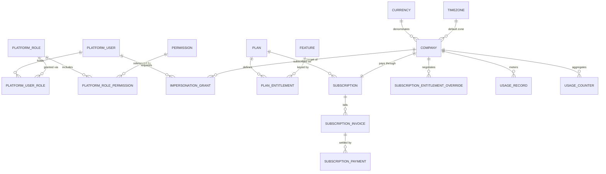
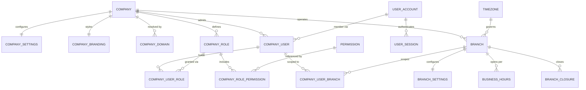
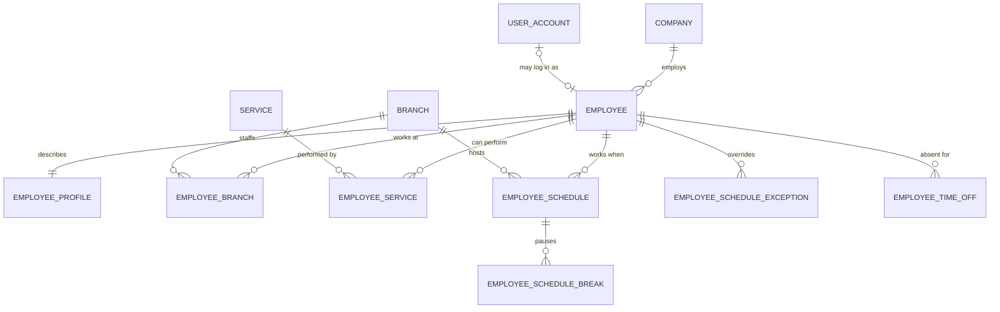
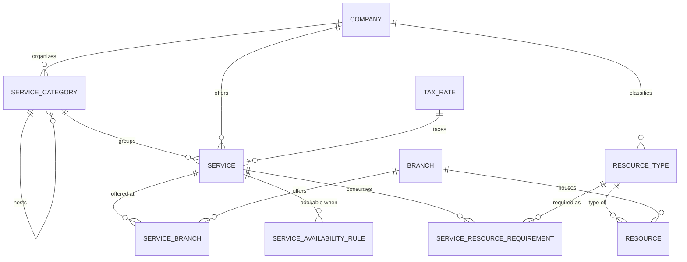
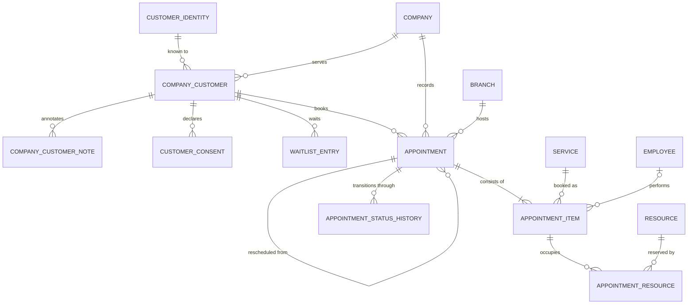
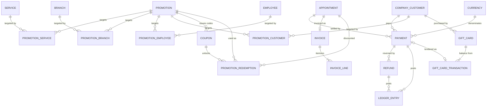
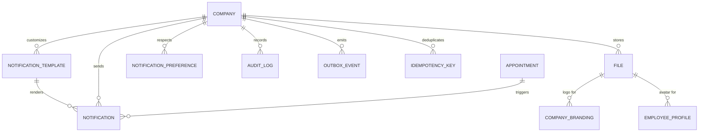

# Database Schema & ERD — Multi-Tenant SaaS Booking Platform

Status: **Proposal for sign-off — no application code written**
Companion to [ARCHITECTURE.md](./ARCHITECTURE.md). Artifacts produced by this task:

| File | Purpose |
|---|---|
| `docs/DATABASE.md` | This document — domain model, ERD, strategies, checklist |
| `apps/api/prisma/schema.prisma` | The Prisma schema |
| `apps/api/prisma/sql/001_hardening.sql` | Everything Prisma cannot express: RLS, exclusion constraints, generated columns, partial unique indexes, CHECKs, partitions |

> **Moved.** These began life under `docs/proposed/`. The multi-tenant foundation task
> promoted them into `apps/api/prisma/` and changed two things — a `platform_session` model
> (the proposal gave staff a session table and overlooked the equivalent for operators) and
> RLS policies denying tenant connections access to `user_session` and `platform_session`.
> The duplicate copies under `docs/proposed/` were deleted rather than left to diverge.
> See [MULTI-TENANCY.md](./MULTI-TENANCY.md).

---

## 0. Decisions this task resolves

Three items were open in `ARCHITECTURE.md §16`. The task brief settles them, and two of them change the earlier design:

| Decision | Earlier position | Now | Consequence |
|---|---|---|---|
| **Customer identity model** (blocking #4) | Per-company `Customer` only | **Global `customer_identity` + per-company `company_customer` profile** | New table, new privacy risk to manage (§4.6). Appointments and all commercial history point at `company_customer`, never at the global identity. |
| **Resources in v1** (blocking #6) | Deferred | **In scope** | `resource`, `resource_type`, `service_resource_requirement`, `appointment_resource`, and a second exclusion constraint. A booking may be employee-only, resource-only, or both. |
| **Promotion rules** | JSON rule engine validated by zod | **Explicit columns + four targeting link tables** | Queryable, indexable, no engine to build. Extension path documented in §8.4. |

Everything else in `ARCHITECTURE.md §16` remains open and is restated in the closing checklist.

---

## 1. Complete domain entity list

76 tables. `T` = tenant-scoped (carries `company_id`), `G` = global, `SD` = soft-deletable, `ST` = has a status/lifecycle field.

### 1.1 Reference data (global)

| # | Table | Scope | Notes |
|---|---|---|---|
| 1 | `currency` | G | ISO 4217 code, `minor_unit` exponent, symbol. Seeded. No currency is hardcoded anywhere else. |
| 2 | `timezone` | G | IANA names seeded from `pg_timezone_names`. Referenced by FK so an invalid zone cannot be stored. |
| 3 | `permission` | G | Flat catalog of permission keys, each tagged `PLATFORM` or `COMPANY`. |
| 4 | `feature` | G | Entitlement catalog: key, value type (`BOOLEAN` / `LIMIT` / `METERED`), unit. |

### 1.2 Platform (global)

| # | Table | Scope | SD | ST | Notes |
|---|---|---|---|---|---|
| 5 | `platform_user` | G | ✓ | ✓ | Operators of the SaaS itself. MFA mandatory. |
| 6 | `platform_role` | G | | | `SUPER_ADMIN`, `SUPPORT`, `BILLING`, `READ_ONLY`. |
| 7 | `platform_role_permission` | G | | | |
| 8 | `platform_user_role` | G | | | |
| 9 | `impersonation_grant` | G | | ✓ | Time-boxed, reasoned, revocable, audited. |

### 1.3 Subscription / SaaS billing

| # | Table | Scope | SD | ST | Notes |
|---|---|---|---|---|---|
| 10 | `plan` | G | ✓ | ✓ | Price, interval, trial length, visibility. |
| 11 | `plan_entitlement` | G | | | `(plan, feature) → limit_int | limit_bool`. |
| 12 | `subscription` | T | | ✓ | Exactly one per company (`company_id` unique). |
| 13 | `subscription_entitlement_override` | T | | | Bespoke enterprise limits, with reason and expiry. |
| 14 | `subscription_invoice` | T | | ✓ | Platform → company invoices. |
| 15 | `subscription_payment` | T | | ✓ | Company → platform money. Deliberately separate from `payment`. |
| 16 | `usage_record` | T | | | Append-only metered events. |
| 17 | `usage_counter` | T | | | Aggregated per `(metric, period_key)` for O(1) quota checks. |

### 1.4 Company

| # | Table | Scope | SD | ST | Notes |
|---|---|---|---|---|---|
| 18 | `company` | T | ✓ | ✓ | The tenant root. `id` is the `company_id` every other tenant table carries. |
| 19 | `company_settings` | T | | | 1:1. Booking policy defaults, cancellation windows, slot granularity. |
| 20 | `company_branding` | T | | | 1:1. Logo, colours, fonts, email header, sanitized CSS. |
| 21 | `company_domain` | T | | ✓ | Hostname → tenant resolution. Globally unique hostname. |
| 22 | `company_role` | T | ✓ | | System roles cloned per company, plus custom roles. |
| 23 | `company_role_permission` | T | | | |
| 24 | `company_user` | T | ✓ | ✓ | Membership of a `user_account` in a company. This is "a company user". |
| 25 | `company_user_role` | T | | | Many-to-many; a person can be Receptionist *and* Employee. |
| 26 | `company_user_branch` | T | | | Branch scope. Absent rows = all branches. |
| 27 | `user_account` | G | ✓ | ✓ | Staff login identity. One human, many companies. |
| 28 | `user_session` | G | | ✓ | Hashed refresh token with family-based reuse detection. |

### 1.5 Branch

| # | Table | Scope | SD | ST | Notes |
|---|---|---|---|---|---|
| 29 | `branch` | T | ✓ | ✓ | Owns its own IANA timezone and currency override. |
| 30 | `branch_settings` | T | | | 1:1. Overrides company booking policy. |
| 31 | `business_hours` | T | | | Weekly local wall-clock opening pattern, with effective-date versioning. |
| 32 | `branch_closure` | T | | | Holidays and one-off closures, as instants. |

### 1.6 Employee

| # | Table | Scope | SD | ST | Notes |
|---|---|---|---|---|---|
| 33 | `employee` | T | ✓ | ✓ | `user_account_id` nullable — not every employee logs in. |
| 34 | `employee_profile` | T | | | 1:1. Bio, avatar, colour, title, languages. |
| 35 | `employee_branch` | T | | | Which branches an employee works at. |
| 36 | `employee_service` | T | | | Which services they can perform, with duration/price overrides. |
| 37 | `employee_schedule` | T | | ✓ | Recurring weekly working pattern, effective-dated. |
| 38 | `employee_schedule_break` | T | | | Recurring unpaid breaks inside a schedule row. |
| 39 | `employee_schedule_exception` | T | | | Single-date override — working or not working. |
| 40 | `employee_time_off` | T | | ✓ | Instant range with approval workflow. |

### 1.7 Service catalog

| # | Table | Scope | SD | ST | Notes |
|---|---|---|---|---|---|
| 41 | `service_category` | T | ✓ | ✓ | Optional self-reference for one level of nesting. |
| 42 | `service` | T | ✓ | ✓ | Base duration, buffers, price, capacity, staffing requirement. |
| 43 | `service_branch` | T | | | Availability plus price/duration override per branch. |
| 44 | `service_availability_rule` | T | | | When a service may be booked (e.g. weekday mornings only). |
| 45 | `service_resource_requirement` | T | | | How many of which resource type a service consumes. |
| 46 | `tax_rate` | T | ✓ | | Per company, parts-per-million rate, inclusive or exclusive. |

### 1.8 Resources

| # | Table | Scope | SD | ST | Notes |
|---|---|---|---|---|---|
| 47 | `resource_type` | T | ✓ | | ROOM, CHAIR, EQUIPMENT, MEETING_ROOM, TREATMENT_ROOM, SERVICE_BAY, OTHER. |
| 48 | `resource` | T | ✓ | ✓ | A concrete bookable thing, always belonging to exactly one branch. |

### 1.9 Customers

| # | Table | Scope | SD | ST | Notes |
|---|---|---|---|---|---|
| 49 | `customer_identity` | **G** | ✓ | ✓ | The **person**. Verified email/phone, optional login. Carries no commercial data. |
| 50 | `company_customer` | T | ✓ | ✓ | The **relationship**. Notes, loyalty, statistics, consents — all per company. |
| 51 | `company_customer_note` | T | ✓ | | Staff notes, private or shared. |
| 52 | `customer_consent` | T | | | Marketing and data-processing consent with source and timestamp. |

### 1.10 Appointments

| # | Table | Scope | SD | ST | Notes |
|---|---|---|---|---|---|
| 53 | `appointment` | T | | ✓✓ | Aggregate root. **Two** independent status fields: lifecycle and payment. |
| 54 | `appointment_item` | T | | ✓ | One row per service. Holds the employee assignment and the reserved time range. |
| 55 | `appointment_resource` | T | | | One row per resource an item occupies. |
| 56 | `appointment_status_history` | T | | | Append-only transition log. |
| 57 | `waitlist_entry` | T | | ✓ | Desired window when nothing is free. |

### 1.11 Payments

| # | Table | Scope | SD | ST | Notes |
|---|---|---|---|---|---|
| 58 | `payment` | T | | ✓ | One row per money-in event: cash, card, transfer, online, gift card, deposit. |
| 59 | `refund` | T | | ✓ | Always references the payment it reverses. |
| 60 | `invoice` | T | | ✓ | Issued on completion. |
| 61 | `invoice_line` | T | | | Snapshot of what was charged. |
| 62 | `ledger_entry` | T | | | Append-only double-entry journal. The reconciliation backbone. |

### 1.12 Promotions

| # | Table | Scope | SD | ST | Notes |
|---|---|---|---|---|---|
| 63 | `promotion` | T | ✓ | ✓ | Explicit columns, not a rule engine. |
| 64 | `promotion_service` | T | | | Service-specific targeting. |
| 65 | `promotion_branch` | T | | | Branch-specific targeting. |
| 66 | `promotion_employee` | T | | | Employee-specific targeting. |
| 67 | `promotion_customer` | T | | | Customer-specific targeting. |
| 68 | `coupon` | T | | ✓ | Zero, one, or many codes per promotion. |
| 69 | `promotion_redemption` | T | | | Immutable usage record with the allocated discount. |

### 1.13 Gift cards

| # | Table | Scope | SD | ST | Notes |
|---|---|---|---|---|---|
| 70 | `gift_card` | T | | ✓ | Hashed code, cached balance under a non-negative CHECK. |
| 71 | `gift_card_transaction` | T | | | Append-only ledger. The balance is derived; the column is a projection. |

### 1.14 Notifications

| # | Table | Scope | SD | ST | Notes |
|---|---|---|---|---|---|
| 72 | `notification_template` | T* | ✓ | | `company_id` nullable — NULL rows are platform defaults readable by all tenants. |
| 73 | `notification` | T | | ✓ | Per-send record with schedule, retries, and failure reason. |
| 74 | `notification_preference` | T | | | Per recipient, per channel, per notification key. |

### 1.15 Cross-cutting infrastructure

| # | Table | Scope | SD | ST | Notes |
|---|---|---|---|---|---|
| 75 | `audit_log` | T* | | | `company_id` nullable — platform-level actions have none. Monthly partitions. |
| 76 | `outbox_event` | T | | ✓ | Written in the same transaction as the state change. |
| 77 | `idempotency_key` | T | | | Stored response for safe POST retries. |
| 78 | `file` | T | | ✓ | Uploads with checksum and virus-scan status. |

> 78 tables including the four reference tables. Four of them (`currency`, `timezone`, `permission`, `feature`) are seed data rather than domain entities, which is why the headline count is 74 domain tables.

---

## 2. Entity relationship explanation

### 2.1 The tenant spine

Everything commercial descends from `company`. A `branch` belongs to exactly one company; an `employee`, `service`, `resource`, `company_customer`, `promotion`, `gift_card`, and `appointment` likewise. This is a strict tree, not a graph — there is no table where a row can legitimately be shared by two companies.

Two deliberate exceptions sit *above* the tenant line:

- **`user_account`** — one human being who works at two companies has one login. Their access to each company is a separate `company_user` row, and those rows are tenant-scoped.
- **`customer_identity`** — one human being who is a customer of two companies has one identity. Their relationship with each company is a separate `company_customer` row, and every note, statistic, loyalty balance and appointment attaches to *that* row.

Both exceptions follow the same shape: **a global identity carrying only what is needed to authenticate and de-duplicate a person, plus a tenant-scoped relationship row carrying everything commercially meaningful.** Nothing in the global row reveals which other companies the person deals with, because the link table is tenant-filtered by RLS in both directions.

### 2.2 Branch as the operational unit

The company is the billing and isolation boundary; the **branch** is the operational one. Business hours, resources, and appointments hang off the branch, and the branch — not the company — owns the IANA timezone that governs booking arithmetic. Employees are assigned to branches many-to-many, because a stylist who covers two locations is normal.

### 2.3 What a booking actually requires

A `service` declares its staffing shape:

| `requires_employee` | `requires_resource` | Example | `appointment_item.employee_id` | `appointment_resource` rows |
|---|---|---|---|---|
| true | false | Haircut | required | none |
| true | true | Massage (therapist + treatment room) | required | ≥ 1 |
| false | true | Car wash bay, self-service equipment hire | NULL | ≥ 1 |
| false | false | Consultation with any available staff, unassigned | NULL | none |

Which resource *types* a service consumes is declared once in `service_resource_requirement`; which concrete `resource` rows a booking took is recorded per booking in `appointment_resource`. This split matters: the requirement is catalog configuration, the assignment is a reservation, and only the assignment participates in overlap constraints.

### 2.4 Appointment composition

`appointment` is the aggregate root and the unit customers and staff talk about. `appointment_item` is one row per service, and it is where the employee, the exact times, and the price snapshot live. Even a single-service booking creates one item — special-casing it would mean rewriting availability, pricing and reporting later.

The appointment's `starts_at` / `ends_at` are the envelope of its items, maintained by the application inside the same transaction. They exist so that calendar queries do not have to aggregate items.

### 2.5 Money never mutates a booking

`payment`, `refund`, `invoice`, `ledger_entry`, `gift_card_transaction` and `promotion_redemption` all reference the appointment; the appointment references none of them. It carries only denormalized totals (`total_minor`, `paid_minor`, `refunded_minor`) and a `payment_status`, both recomputed from the payment tables inside the transaction that changes them. That direction of dependency means money records can be added, corrected and reconciled without touching booking history.

### 2.6 Two separate money systems

`payment` handles **customer → company**. `subscription_payment` handles **company → platform**. They share no tables, no provider credentials, and no ledger. Conflating them would make the platform merchant-of-record for every haircut in the system.

---

## 3. ERD (Mermaid)

Seven diagrams rather than one 78-table blob, split along the real coupling lines.

### 3.1 Platform, reference data, and SaaS subscription



### 3.2 Company, access control, and branches



### 3.3 Employees and scheduling



### 3.4 Service catalog and resources



### 3.5 Customers and appointments



### 3.6 Payments, promotions, and gift cards



### 3.7 Notifications, audit, and infrastructure



---

## 4. Multi-tenant data isolation strategy

### 4.1 The rule

> Every table that can contain data belonging to a specific company carries a non-nullable `company_id`, and every query against it is filtered by `company_id` at the **database**, not the application.

Four independent layers enforce it. Any one of them failing still leaves three.

| Layer | Mechanism | Fails how |
|---|---|---|
| 1. Database | PostgreSQL **Row-Level Security** policy per table | Only if someone connects as a `BYPASSRLS` role |
| 2. Referential | **Composite foreign keys** on `(company_id, id)` | Cannot fail — a cross-tenant FK is unrepresentable |
| 3. ORM | Prisma client extension that injects `companyId` and throws when no tenant context is set | Only if bypassed with `$queryRaw` |
| 4. Test | Standing suite asserting **404** for another tenant's IDs on every route | Catches regressions in 1–3 |

### 4.2 Why every tenant table carries `company_id`, including derivable ones

`appointment_item.company_id` is derivable from `appointment_id`. `gift_card_transaction.company_id` is derivable from `gift_card_id`. They carry it anyway, for three reasons:

1. **RLS policies cannot join.** A policy is a predicate over the row being read. `USING (company_id = current_setting(...))` requires a local column; a policy that has to join to a parent is either impossible or catastrophically slow.
2. **Composite FKs need it.** `appointment_resource(company_id, resource_id) → resource(company_id, id)` is what makes it structurally impossible to reserve another tenant's treatment room. Without a local `company_id`, that constraint cannot be written.
3. **Index locality.** Every tenant index leads with `company_id`, which keeps one tenant's index pages together and makes the planner's cardinality estimates far better than a global index on `starts_at`.

The denormalization is kept honest by the composite FK itself: `appointment_item(company_id, appointment_id) → appointment(company_id, id)` makes a mismatched `company_id` a constraint violation, not a silent inconsistency.

### 4.3 Every entity requiring `company_id`, and why

| Group | Tables | Why |
|---|---|---|
| **Tenant root** | `company` | Its `id` *is* the tenant key. |
| **Configuration** | `company_settings`, `company_branding`, `company_domain`, `branch`, `branch_settings`, `business_hours`, `branch_closure` | Operational configuration; leaking it exposes a competitor's opening hours, locations and branding assets. |
| **Access control** | `company_role`, `company_role_permission`, `company_user`, `company_user_role`, `company_user_branch` | A role or membership readable across tenants is a direct privilege-escalation path. |
| **Staff** | `employee`, `employee_profile`, `employee_branch`, `employee_service`, `employee_schedule`, `employee_schedule_break`, `employee_schedule_exception`, `employee_time_off` | Personnel data and, in the case of time off, health-adjacent personal data. |
| **Catalog** | `service_category`, `service`, `service_branch`, `service_availability_rule`, `service_resource_requirement`, `tax_rate` | Pricing is commercially sensitive; a competitor reading another tenant's price list is a direct business harm. |
| **Resources** | `resource_type`, `resource` | Physical capacity is competitive intelligence, and cross-tenant reservation would be an operational disaster. |
| **Customers** | `company_customer`, `company_customer_note`, `customer_consent` | The single most sensitive dataset in the system. Notes may contain health, financial or personal information. Consent is legally binding and per-controller. |
| **Bookings** | `appointment`, `appointment_item`, `appointment_resource`, `appointment_status_history`, `waitlist_entry` | Reveals customers, revenue, utilization and staffing. |
| **Money** | `payment`, `refund`, `invoice`, `invoice_line`, `ledger_entry` | Financial records. Cross-tenant visibility is both a breach and an accounting corruption. |
| **Promotions** | `promotion`, `promotion_service`, `promotion_branch`, `promotion_employee`, `promotion_customer`, `coupon`, `promotion_redemption` | Discount strategy is commercially sensitive; a coupon redeemable at the wrong tenant is theft. |
| **Gift cards** | `gift_card`, `gift_card_transaction` | Bearer instruments representing a liability of a specific company. Cross-tenant redemption is theft. |
| **Notifications** | `notification`, `notification_preference`, `notification_template`* | Contains recipient contact details and message bodies with booking specifics. |
| **Billing** | `subscription`, `subscription_entitlement_override`, `subscription_invoice`, `subscription_payment`, `usage_record`, `usage_counter` | A tenant's plan, spend and negotiated terms. |
| **Infrastructure** | `outbox_event`, `idempotency_key`, `file`, `audit_log`* | Event payloads, cached API responses and uploaded files all embed tenant data. |

\* `notification_template` and `audit_log` have a **nullable** `company_id`. See 4.5.

### 4.4 Tables that correctly have no `company_id`

| Table | Why global | Isolation risk and mitigation |
|---|---|---|
| `currency`, `timezone`, `permission`, `feature` | Immutable seed data, identical for everyone | None. Read-only to all roles. |
| `plan`, `plan_entitlement` | The platform's product catalog | None. Public by design. |
| `platform_user`, `platform_role`, `platform_role_permission`, `platform_user_role`, `impersonation_grant` | Belong to the platform operator, not any tenant | Not readable by the `app_tenant` role at all — RLS policy denies everything. |
| `user_account` | One human, many employers | Contains only login identity. A tenant can read a `user_account` **only** through a `company_user` row it owns; the join is RLS-filtered on the tenant side. |
| `user_session` | Keyed to `user_account` | Never exposed through a tenant-facing API. |
| `customer_identity` | One human, many companies | **The highest-risk table in the schema.** See 4.6. |

### 4.5 The two nullable `company_id` columns

Both are deliberate and both need a policy that admits NULL:

```sql
-- notification_template: platform-provided defaults are readable by every tenant,
-- but only a tenant's own overrides are writable.
CREATE POLICY nt_read  ON notification_template FOR SELECT
  USING (company_id IS NULL OR company_id = current_company_id());
CREATE POLICY nt_write ON notification_template FOR ALL
  USING (company_id = current_company_id())
  WITH CHECK (company_id = current_company_id());
```

`audit_log` rows for platform-level actions (a plan being edited, a company being provisioned) have no tenant. Tenants read only their own:

```sql
CREATE POLICY audit_read ON audit_log FOR SELECT
  USING (company_id = current_company_id());   -- NULL rows are invisible to tenants
```

### 4.6 The `customer_identity` risk, stated plainly

A global person table in a multi-tenant system creates one specific attack: **existence disclosure**. If Company B types a customer's email into their booking form and the system silently links to an existing `customer_identity`, Company B has learned that this person exists in the platform — and if any linked field is echoed back (a pre-filled name, a "welcome back" message), Company B has learned something Company A gave them.

Four mitigations, all mandatory:

1. **Linking requires proof of control.** A `company_customer` row is linked to a `customer_identity` only after the person verifies the email or phone in *that* booking flow (OTP or magic link). An unverified booking creates an **unlinked** `company_customer` with its own copy of the contact details. Linking may happen later, on verification.
2. **Nothing is pre-filled from the global identity** until verification completes. The booking form never says "welcome back".
3. **No global-identity field is tenant-writable.** A company can write its own `company_customer` row; it cannot update `customer_identity`.
4. **`customer_identity` is never returned by a tenant-facing API.** Responses expose `company_customer` fields only. The identity ID is internal and is not the ID used in URLs.

The `company_customer` row is the tenant's copy of first name, last name, email and phone. That duplication is intentional — it is what lets Company A and Company B hold different, independently-editable records of the same human without either of them seeing the other's.

### 4.7 Roles, pooling, and the worker

Two database roles:

```sql
CREATE ROLE app_tenant   NOINHERIT LOGIN;              -- RLS enforced. All request traffic.
CREATE ROLE app_platform NOINHERIT LOGIN BYPASSRLS;    -- Platform module + migrations only.
```

Tenant context is set per transaction:

```sql
BEGIN;
  SET LOCAL app.current_company_id = '018f...';
  -- all statements here are RLS-filtered
COMMIT;
```

`SET LOCAL` is transaction-scoped, which makes it safe behind **transaction-mode** pgBouncer. Session-mode pooling, or `SET` without `LOCAL`, leaks tenant context between requests — this is the single most likely way to break isolation in production.

**Background workers** cannot scan `notification WHERE status = 'PENDING'` across all tenants under RLS. The dispatcher therefore runs in two steps: a claim query on the `app_platform` pool that returns only `(company_id, id)` pairs, then per-tenant processing that sets the tenant context and does the real work on `app_tenant`. The privileged step touches no tenant payload.

---

## 5. Appointment relationship design

### 5.1 Shape

```
appointment (1) ──< appointment_item (1..n) ──< appointment_resource (0..n)
     │                      │                            │
     │                      ├── service_id      (required)
     │                      ├── employee_id     (nullable — resource-only bookings)
     │                      └── starts_at / ends_at / reserved_range
     │
     ├── company_id, branch_id, customer_id  (all composite-FK'd)
     ├── status          : appointment lifecycle
     ├── payment_status  : money state, INDEPENDENT
     ├── rescheduled_from_id  (self-reference)
     └──< appointment_status_history (append-only)
```

### 5.2 Why items exist even for one service

Three things become impossible without them: per-service employee assignment in a multi-service booking; the per-employee exclusion constraint (which needs one time range per employee, not per appointment); and correct per-line discount allocation when a partial refund is issued.

### 5.3 The two status fields

They are deliberately independent, because every combination below is real:

| `status` | `payment_status` | Real situation |
|---|---|---|
| `CONFIRMED` | `UNPAID` | Pay at the salon |
| `CONFIRMED` | `DEPOSIT_PAID` | 30% taken online |
| `COMPLETED` | `UNPAID` | Served on account; invoice to follow |
| `CANCELLED` | `PAID` | Cancelled after payment; refund pending |
| `CANCELLED` | `PARTIALLY_REFUNDED` | Late cancellation, fee retained |
| `NO_SHOW` | `PAID` | Prepaid, did not attend; no refund per policy |

```
status:          HOLD → PENDING → CONFIRMED → CHECKED_IN → IN_PROGRESS → COMPLETED
                   │       │           │            │
                   │       └───────────┴────────────┴──→ CANCELLED
                   │                                └──→ NO_SHOW
                   └──→ EXPIRED  (hold_expires_at passed, swept by worker)

payment_status:  UNPAID → DEPOSIT_PAID → PARTIALLY_PAID → PAID
                    └──────────────────────────────────────┴──→ PARTIALLY_REFUNDED → REFUNDED
                                                            └──→ VOID
```

`HOLD` and `EXPIRED` are additions to the seven statuses in the brief. `HOLD` is what makes the exclusion constraint able to protect a slot while the customer is on the payment page; `EXPIRED` is its terminal state. Without them, two customers can both reach checkout for the same slot.

### 5.4 Cancellation and rescheduling

**Cancellation** is a status transition plus four fields on the appointment (`cancelled_at`, `cancelled_by_type`, `cancelled_by_id`, `cancellation_reason`) and a history row. Rows are never deleted — a cancelled appointment is a reportable event and often a billable one.

**Rescheduling** is *cancel-and-create*, not an in-place time change. The new appointment carries `rescheduled_from_id`; the old one moves to `CANCELLED` with `cancellation_reason = 'RESCHEDULED'`. This preserves the audit trail, keeps utilization reporting honest, and — critically — lets the exclusion constraint release the old slot and claim the new one as two ordinary row operations inside one transaction, rather than an update that must not transiently overlap itself.

### 5.5 Booking source and actor

`source` (`ONLINE`, `WALK_IN`, `PHONE`, `STAFF`, `IMPORT`, `API`) records the channel. `created_by_type` + `created_by_id` record the actor and are **deliberately polymorphic with no foreign key**, because the actor may be a `company_user`, a `company_customer`, a `platform_user` acting under an impersonation grant, or `SYSTEM`. A FK cannot span four tables, two of which are global; the application validates the pair, and `audit_log` carries the authoritative record.

---

## 6. Schedule relationship design

Availability is computed from five sources. Four are recurring rules stored as **local wall-clock times**; one is a set of instants.

| Source | Table | Time representation | Effect |
|---|---|---|---|
| Branch opening hours | `business_hours` | `day_of_week` + `time` | Outer bound |
| Service bookability window | `service_availability_rule` | `day_of_week` + `time` | Narrows per service |
| Employee working pattern | `employee_schedule` | `day_of_week` + `time`, effective-dated | Intersects |
| Employee breaks | `employee_schedule_break` | `time` within a schedule row | Subtracts |
| Single-date override | `employee_schedule_exception` | `date` + `time`, or "not working" | Replaces that day |
| Branch closures | `branch_closure` | `timestamptz` range | Subtracts |
| Approved time off | `employee_time_off` | `timestamptz` range | Subtracts |
| Existing bookings | `appointment_item`, `appointment_resource` | `timestamptz` range | Subtracts |

```
available(employee, date) =
     business_hours(branch, dow)
   ∩ employee_schedule(employee, dow)        [ or schedule_exception if one exists for the date ]
   ∩ service_availability_rule(service, dow)
   − employee_schedule_break
   − branch_closure
   − employee_time_off  WHERE status = 'APPROVED'
   − appointment_item   WHERE status blocks the calendar
   − appointment_resource                     [ when the service needs a resource ]
```

### 6.1 Why recurring rules use `time`, not `timestamptz`

A branch that opens at 09:00 opens at 09:00 on the day the clocks change too. Storing that as an instant, or as a fixed UTC offset, produces a branch that opens at 08:00 for half the year. Recurring rules are therefore stored as `TIME WITHOUT TIME ZONE` plus `day_of_week`, and are converted to instants **per concrete date** in the branch's IANA timezone:

```sql
-- local wall clock → instant, DST-correct
(date '2026-03-29' + time '09:00') AT TIME ZONE branch.timezone
```

### 6.2 Effective dating

`business_hours` and `employee_schedule` carry `effective_from` / `effective_to`. Changing next month's hours must not rewrite last month's — otherwise historical utilization reports become fiction. The application selects the row whose effective range contains the target date; the "current" pattern is simply the row with `effective_to IS NULL`.

### 6.3 Overnight shifts

A shift from 22:00 to 06:00 has `ends_at < starts_at`. The schema permits it with a flag (`crosses_midnight`, a generated boolean) rather than forbidding it, and the materializer emits two intervals. Rejecting it would exclude every 24-hour business.

### 6.4 The materialized read model

`AvailabilityDay` from `ARCHITECTURE.md §8` is intentionally **not** a table in this schema. It is a cache, derivable in full from the tables above, and putting it in the migration history invites it being treated as source data. It belongs in Redis with a nightly rebuild, and is introduced in phase 4 when the availability engine is built.

---

## 7. Payment relationship design

### 7.1 One table per money event

```
appointment ──< payment ──< refund
                  │  └──< ledger_entry
                  └──o gift_card_transaction   (when method = GIFT_CARD)
appointment ──o invoice ──< invoice_line
```

A `payment` row is one money-in event. Partial payment is simply **several rows against one appointment** — there is no special "partial" flag, because a deposit followed by a balance payment followed by a tip is three rows and the arithmetic must work regardless of how many there are.

| Requirement | How it is modelled |
|---|---|
| Cash | `method = CASH`, `status = SUCCEEDED` immediately, `received_by_company_user_id` set |
| Card (terminal) | `method = CARD`, provider reference optional |
| Bank transfer | `method = BANK_TRANSFER`, `status = PENDING` until reconciled |
| Online | `method = ONLINE`, `provider_intent_id`, status driven by webhook |
| Gift card | `method = GIFT_CARD`, paired 1:1 with a `gift_card_transaction` of type `REDEEM` |
| Deposit | `purpose = DEPOSIT` on an otherwise ordinary payment |
| Partial payment | Multiple `payment` rows; `appointment.paid_minor` is their sum |
| Refund | A `refund` row referencing the `payment` it reverses |

### 7.2 Payment intent folded into payment

`ARCHITECTURE.md §9` proposed a separate `payment_intent`. This schema folds it into `payment` with a `status` of `PENDING → SUCCEEDED / FAILED / CANCELLED` and the provider's intent and charge identifiers as columns. The separate table earns its keep only when one intent yields several captures, which this domain does not do. Fewer tables, one lifecycle, same guarantees.

### 7.3 Idempotency

`payment.idempotency_key` is globally unique and non-nullable for provider-backed methods. A retried checkout returns the existing row rather than charging twice. Webhook events are deduplicated separately by provider event ID in `idempotency_key`.

### 7.4 The ledger

Every payment, refund, discount and gift card movement writes balanced `ledger_entry` rows sharing a `journal_id`:

```
Booking 50,000 · coupon −10,000 · gift card 20,000 · card 20,000 · 10% inclusive tax

journal_id = 018f-…
  DR  GIFT_CARD_LIABILITY   20,000
  DR  CASH_CLEARING         20,000
  DR  DISCOUNT              10,000
      CR  REVENUE                   45,455
      CR  TAX_PAYABLE                4,545
```

A CHECK enforces that exactly one of `debit_minor` / `credit_minor` is non-zero per row; a nightly job asserts every `journal_id` sums to zero. Without this, partial refunds against split tender cannot be reconciled — and it cannot be retrofitted, because the historical entries would not exist.

### 7.5 Denormalized totals on the appointment

`appointment.paid_minor` and `refunded_minor` are projections of the payment tables, updated in the same transaction that inserts a payment or refund, and used to derive `payment_status`. They exist so a calendar view showing 200 appointments does not need 200 aggregate subqueries. A nightly reconciliation job re-derives them and reports drift.

---

## 8. Promotion relationship design

### 8.1 Explicit columns, not a rule engine

Per the brief, promotions are modelled as typed columns plus four targeting tables. Every rule in the requirement list maps to a column or a link table:

| Requirement | Column / table |
|---|---|
| Percentage discount | `discount_type = PERCENTAGE`, `discount_value` (basis points) |
| Fixed amount discount | `discount_type = FIXED_AMOUNT`, `discount_amount_minor`, `currency` |
| Coupon | `requires_coupon = true` + rows in `coupon` |
| Service-specific | `promotion_service` |
| Branch-specific | `promotion_branch` |
| Employee-specific | `promotion_employee` |
| Time-based | `days_of_week smallint[]`, `time_from`, `time_to` |
| New customer | `new_customers_only boolean` |
| Minimum purchase | `min_purchase_minor` |
| Usage limits | `max_redemptions`, `max_redemptions_per_customer`, `redeemed_count` |
| Date range | `starts_at`, `ends_at` (instants) |
| Customer-specific | `promotion_customer` |

An **empty targeting table means "all"**. No rows in `promotion_branch` = valid at every branch. This keeps the common case (a company-wide promotion) free of rows and makes the query a simple `NOT EXISTS OR EXISTS` pair.

### 8.2 Percentages as basis points

`discount_value` is an integer in basis points: 15% is `1500`. Storing 15.5% as a float, or as `NUMERIC(5,2)` that later gets multiplied by an integer amount, is how rounding errors enter a money system. `max_discount_minor` caps the result.

### 8.3 Redemption under concurrency

Usage limits are consumed with a conditional update inside the booking transaction, never read-then-write:

```sql
UPDATE promotion SET redeemed_count = redeemed_count + 1
 WHERE id = $1 AND company_id = $2
   AND (max_redemptions IS NULL OR redeemed_count < max_redemptions)
RETURNING id;   -- zero rows ⇒ abort with PROMOTION_EXHAUSTED
```

Per-customer limits are enforced by a partial unique index on `promotion_redemption (company_id, promotion_id, customer_id)` when `max_redemptions_per_customer = 1`, and by the same conditional-update pattern otherwise.

### 8.4 The extension path

When a rule arrives that these columns cannot express — "buy two, get the third free", or bundle pricing — the addition is a nullable `rule_json JSONB` column plus a `rule_version` integer, evaluated by an engine that runs **only** when `rule_version > 0`. Existing promotions keep working untouched. That is a strictly additive migration, which is why the simple model is safe to start with.

---

## 9. Gift card ledger design

### 9.1 A liability, not a discount

`gift_card_transaction` is append-only and is the authoritative balance. `gift_card.current_balance_minor` is a cached projection updated in the same transaction, under `CHECK (current_balance_minor >= 0)`.

```
balance(card) = SUM(amount_minor) OVER all transactions for that card
```

Transaction types, all signed:

| Type | Sign | Trigger |
|---|---|---|
| `ISSUE` | + | Purchase payment succeeded |
| `REDEEM` | − | Applied as tender on an appointment |
| `REFUND` | + | A card-paid appointment was refunded to the card |
| `ADJUST` | ± | Staff correction — requires `giftcard:adjust`, a reason, and an audit row |
| `EXPIRE` | − | Remaining balance written off, where legally permitted |
| `VOID` | − | Fraud or chargeback; card moved to `VOID` |

Every row stores `balance_after_minor`, which makes the ledger self-checking: a replay that disagrees with the stored running balance is a detected corruption rather than a silent one.

### 9.2 Codes

Never stored in plaintext. `code_hash` (HMAC-SHA256 with a server-side pepper) is **globally** unique — not per company — so that a redemption lookup can never accidentally match a card from another tenant even before the `company_id` predicate applies. `code_last4` is stored for display; an optional `pin_hash` guards physical cards.

### 9.3 Concurrency

Redemption happens inside the booking transaction:

```sql
SELECT current_balance_minor FROM gift_card
 WHERE id = $1 AND company_id = $2 FOR UPDATE;   -- row lock
-- validate, then INSERT gift_card_transaction and UPDATE gift_card in the same tx
```

The row lock plus the non-negative CHECK make overdraw impossible under any interleaving. Two simultaneous redemptions serialize; the loser sees a smaller balance and either partially redeems or fails cleanly.

### 9.4 Scope

`gift_card.company_id` is the isolation boundary; the composite FK from `gift_card_transaction` makes a cross-tenant transaction unrepresentable. Optional `branch_id` restricts a card to one location. Expiry defaults to NULL (never), because in many jurisdictions gift card expiry is restricted or prohibited — this remains an open legal question.

---

## 10. Subscription design

### 10.1 Entitlements are data

```
plan ──< plan_entitlement >── feature
  │
  └──< subscription (one per company) ──< subscription_invoice ──< subscription_payment
              │
              └── overridden by subscription_entitlement_override
```

`feature.value_type` is `BOOLEAN` (has it or not), `LIMIT` (a hard ceiling), or `METERED` (counted and possibly billed). The effective entitlement for a company is:

```
effective(company, feature) =
    COALESCE(override.value, plan_entitlement.value)
    where the override has not expired
```

Seed features covering the brief's list: `max_branches`, `max_employees`, `max_customers`, `max_monthly_appointments`, `storage_mb`, `sms_credits_monthly`, `custom_domain`, `custom_branding`, `advanced_reports`, `api_access`, `data_export`.

### 10.2 Quota enforcement

Two mechanisms, because they answer different questions:

- **Stock limits** (`max_branches`, `max_employees`, `max_customers`) are checked with a `COUNT(*)` inside the creating transaction. Cheap, because the counts are small and tenant-filtered.
- **Flow limits** (`max_monthly_appointments`, `sms_credits_monthly`, `storage_mb`) use `usage_counter`, incremented atomically with `INSERT … ON CONFLICT (company_id, metric, period_key) DO UPDATE SET value = usage_counter.value + EXCLUDED.value RETURNING value`. The returning value is compared to the limit in the same statement round-trip. `usage_record` keeps the append-only detail for billing and dispute resolution.

### 10.3 Lifecycle

```
TRIALING ──► ACTIVE ──► PAST_DUE ──► GRACE ──► SUSPENDED ──► CANCELED
    │           │                                               │
    └───────────┴──► CANCELED                    data retained 90d → export → purge
```

`GRACE` is read-only: existing bookings are honoured and the public booking page stays live, but admin writes are blocked. Nothing is deleted on suspension — a lapsed company that pays on day 20 must find its customer list intact.

### 10.4 Separation from customer payments

`subscription_payment` is a different table from `payment`, with different provider credentials and a different ledger. There is no foreign key between the two subsystems and no shared enum. This is the schema-level expression of "the platform is not merchant-of-record for a haircut".

---

## 11. Required indexes

Every tenant index leads with `company_id`. Beyond the implicit primary-key and unique-constraint indexes:

### 11.1 Hot path — availability and calendar

| Table | Index | Serves |
|---|---|---|
| `appointment` | `(company_id, branch_id, starts_at)` | Calendar day/week view |
| `appointment` | `(company_id, starts_at) WHERE status IN ('CONFIRMED','CHECKED_IN','IN_PROGRESS')` | Active-booking scans |
| `appointment` | `(company_id, customer_id, starts_at DESC)` | Customer history panel |
| `appointment` | `(company_id, status, starts_at)` | Status dashboards |
| `appointment` | `(hold_expires_at) WHERE status = 'HOLD'` | Hold sweeper (no `company_id` — a cross-tenant job on the platform pool) |
| `appointment_item` | **GIST** `(employee_id, reserved_range)` via the exclusion constraint | Overlap detection *and* per-employee day queries |
| `appointment_item` | `(company_id, employee_id, starts_at)` | Employee schedule view |
| `appointment_item` | `(company_id, service_id, starts_at)` | Service utilization reports |
| `appointment_resource` | **GIST** `(resource_id, reserved_range)` via the exclusion constraint | Resource overlap |
| `employee_schedule` | `(company_id, employee_id, day_of_week, effective_from)` | Schedule expansion |
| `employee_time_off` | `(company_id, employee_id, starts_at, ends_at) WHERE status = 'APPROVED'` | Availability subtraction |
| `business_hours` | `(company_id, branch_id, day_of_week)` | Availability outer bound |
| `branch_closure` | `(company_id, branch_id, starts_at)` | Availability subtraction |

### 11.2 Lookup and search

| Table | Index |
|---|---|
| `company_domain` | `(hostname)` unique — tenant resolution on every public request |
| `company_customer` | `(company_id, phone)`, `(company_id, email)`, GIN trigram on `(first_name || ' ' || last_name)` |
| `company_customer` | `(company_id, customer_identity_id)` unique |
| `company_user` | `(company_id, user_account_id)` unique, `(user_account_id)` for "my companies" |
| `employee` | `(company_id, status) WHERE deleted_at IS NULL` |
| `service` | `(company_id, category_id, status) WHERE deleted_at IS NULL` |
| `resource` | `(company_id, branch_id, resource_type_id) WHERE deleted_at IS NULL` |
| `gift_card` | `(code_hash)` unique |
| `coupon` | `(company_id, code)` unique |

### 11.3 Money and reporting

| Table | Index |
|---|---|
| `payment` | `(company_id, appointment_id)`, `(company_id, created_at DESC)`, `(company_id, status, method)` |
| `refund` | `(company_id, payment_id)` |
| `ledger_entry` | `(company_id, occurred_at)`, `(company_id, account, occurred_at)`, `(journal_id)` |
| `invoice` | `(company_id, issued_at DESC)`, `(company_id, appointment_id)` |
| `gift_card_transaction` | `(company_id, gift_card_id, occurred_at)` |
| `promotion_redemption` | `(company_id, promotion_id)`, `(company_id, customer_id)` |
| `usage_counter` | `(company_id, metric, period_key)` unique |

### 11.4 Operational

| Table | Index |
|---|---|
| `notification` | `(status, scheduled_for) WHERE status IN ('PENDING','RETRYING')` — dispatcher claim, platform pool |
| `notification` | `(company_id, created_at DESC)`, `(company_id, appointment_id)` |
| `outbox_event` | `(published_at, occurred_at) WHERE published_at IS NULL` — dispatcher claim |
| `audit_log` | `(company_id, occurred_at DESC)`, `(company_id, resource_type, resource_id)`, `(company_id, actor_id, occurred_at DESC)` |
| `idempotency_key` | `(company_id, key)` unique, `(expires_at)` for the sweeper |
| `user_session` | `(user_account_id)`, `(token_hash)` unique, `(expires_at)` |

---

## 12. Required unique constraints

### 12.1 Global

| Table | Constraint | Rationale |
|---|---|---|
| `company` | `slug` | Subdomain routing |
| `company_domain` | `hostname` | Two tenants cannot claim one hostname |
| `user_account` | `email` (citext) | One login per address |
| `customer_identity` | `email` (citext) where not null | Person de-duplication |
| `customer_identity` | `phone` (E.164) where not null | Person de-duplication |
| `user_session` | `token_hash` | |
| `gift_card` | `code_hash` | Bearer instrument; global to prevent cross-tenant collision |
| `payment` | `idempotency_key` where not null | Prevents double charge |
| `plan` | `key` | |
| `feature` | `key` | |
| `permission` | `key` | |
| `currency` | `code` (PK) | |
| `timezone` | `name` (PK) | |

### 12.2 Per tenant

| Table | Constraint |
|---|---|
| *every tenant table* | `(company_id, id)` — the target of composite foreign keys |
| `branch` | `(company_id, code)` partial, where `deleted_at IS NULL` |
| `employee` | `(company_id, employee_code)` partial |
| `service` | `(company_id, code)` partial |
| `service_category` | `(company_id, name, parent_id)` partial |
| `resource` | `(company_id, branch_id, code)` partial |
| `company_customer` | `(company_id, customer_identity_id)` where not null |
| `company_customer` | `(company_id, email)` and `(company_id, phone)`, both partial where not null and not deleted |
| `company_user` | `(company_id, user_account_id)` |
| `company_role` | `(company_id, key)` partial |
| `appointment` | `(company_id, appointment_number)` |
| `invoice` | `(company_id, number)` |
| `payment` | `(company_id, payment_number)` |
| `coupon` | `(company_id, code)` |
| `promotion_redemption` | `(company_id, coupon_id, appointment_id)` where coupon not null |
| `promotion_redemption` | `(company_id, promotion_id, customer_id)` partial, only when the promotion is once-per-customer |
| `subscription` | `(company_id)` — one subscription per company |
| `usage_counter` | `(company_id, metric, period_key)` |
| `business_hours` | `(company_id, branch_id, day_of_week, effective_from)` |
| `employee_branch` | `(company_id, employee_id, branch_id)` |
| `employee_service` | `(company_id, employee_id, service_id)` |
| `service_branch` | `(company_id, service_id, branch_id)` |
| `service_resource_requirement` | `(company_id, service_id, resource_type_id)` |
| `promotion_service` / `_branch` / `_employee` / `_customer` | `(company_id, promotion_id, <target>_id)` |
| `notification` | `(company_id, dedupe_key)` where not null |
| `idempotency_key` | `(company_id, key)` |

> **Partial uniqueness and soft delete.** `(company_id, code) WHERE deleted_at IS NULL` lets a company delete a branch coded `DT` and later create a new one with the same code, while the old row stays referenced by history. Prisma cannot express a filtered unique index — every constraint marked *partial* above is created in `001_hardening.sql`, and the corresponding `@@unique` is **omitted** from the Prisma schema so `prisma migrate diff` does not fight it.

---

## 13. Double-booking prevention strategy

Four layers. Only the second is a guarantee; the others are latency and ergonomics.

### 13.1 Layer 1 — advisory availability (fast, wrong under load)

The availability endpoint reads a Redis-cached slot list. It is explicitly **advisory**. A stale slot must cause a polite retry, never a double booking.

### 13.2 Layer 2 — PostgreSQL exclusion constraints (the guarantee)

```sql
CREATE EXTENSION IF NOT EXISTS btree_gist;

-- reserved_range is a GENERATED column spanning the booking plus its buffers
ALTER TABLE appointment_item
  ADD COLUMN reserved_range tstzrange
  GENERATED ALWAYS AS (
    tstzrange(
      starts_at - make_interval(mins => buffer_before_min),
      ends_at   + make_interval(mins => buffer_after_min),
      '[)'
    )
  ) STORED;

ALTER TABLE appointment_item
  ADD CONSTRAINT appointment_item_employee_no_overlap
  EXCLUDE USING gist (
    company_id  WITH =,
    employee_id WITH =,
    reserved_range WITH &&
  )
  WHERE (employee_id IS NOT NULL AND blocks_calendar);

ALTER TABLE appointment_resource
  ADD CONSTRAINT appointment_resource_no_overlap
  EXCLUDE USING gist (
    company_id  WITH =,
    resource_id WITH =,
    reserved_range WITH &&
  )
  WHERE (blocks_calendar);
```

`blocks_calendar` is a stored boolean maintained alongside the item's status — true for `HOLD`, `PENDING`, `CONFIRMED`, `CHECKED_IN`, `IN_PROGRESS`; false for `CANCELLED`, `NO_SHOW`, `COMPLETED`, `EXPIRED`. Using a plain boolean rather than a `status IN (…)` predicate keeps the constraint's WHERE clause immutable, which matters because changing an exclusion constraint's predicate later requires a full table rewrite with an ACCESS EXCLUSIVE lock.

`company_id WITH =` is in the constraint not because two tenants could ever share an employee — the composite FK prevents that — but because it makes the GIST index's leading column the tenant, which is what keeps overlap checks fast once the table is large.

**This is the only thing standing between the system and a double booking.** Application checks lose every race; this does not.

### 13.3 Layer 3 — transaction and re-validation

The booking write is a single transaction that sets tenant context, re-reads availability, inserts the rows, and lets the constraint arbitrate. A `23P01 exclusion_violation` is caught and mapped to a domain error (`SLOT_TAKEN`, HTTP 409), not a 500.

Group services (`service.capacity > 1`) sit outside the exclusion constraint by construction — `blocks_calendar` is false for them — and instead use `SELECT … FOR UPDATE` on the session row with a counted check. **Group bookings are out of v1 scope**; the column exists so adding them is not a migration of the constraint.

### 13.4 Layer 4 — Redis advisory lock (ergonomics only)

A short lock on `(company_id, employee_id, date)` held during the booking transaction turns a rare constraint violation into a clean "someone just took that slot" instead of an error page. It is an optimization. If Redis is down, bookings still cannot double-book.

### 13.5 The hold mechanism

A slot the customer is paying for is a real `appointment` row in `HOLD` status with `hold_expires_at` set 5–10 minutes out. Because `blocks_calendar` is true for `HOLD`, it participates in the exclusion constraint, so two customers cannot both reach a payment page for one slot. A worker sweeps expired holds to `EXPIRED`, which flips `blocks_calendar` false and releases the slot.

### 13.6 Optimistic concurrency on edits

`appointment.version` is incremented on every write. A concurrent edit from two staff members produces a version mismatch and a 409 rather than a silent last-write-wins.

---

## 14. Soft-delete strategy

### 14.1 The split

| Category | Tables | Deletion model |
|---|---|---|
| **Master data** referenced by history | `company`, `branch`, `employee`, `service`, `service_category`, `resource`, `resource_type`, `company_customer`, `company_role`, `promotion`, `tax_rate`, `notification_template`, `user_account`, `customer_identity`, `plan`, `platform_user`, `company_user`, `company_customer_note`, `file` | **Soft delete** — `deleted_at TIMESTAMPTZ NULL`. The row must survive because appointments, payments and audit rows point at it. |
| **Transactional records** | `appointment`, `appointment_item`, `payment`, `refund`, `invoice`, `ledger_entry`, `gift_card`, `gift_card_transaction`, `promotion_redemption`, `subscription_invoice`, `audit_log`, `notification` | **Never deleted.** State changes via `status` (`CANCELLED`, `VOID`, `REFUNDED`). Hiding a financial record is worse than showing a cancelled one. |
| **Join / configuration rows** | `employee_branch`, `employee_service`, `service_branch`, `promotion_*`, `company_user_role`, `company_user_branch`, `plan_entitlement`, `business_hours`, `employee_schedule` | **Hard delete.** They carry no independent history; removing "this stylist can cut hair" is a configuration change, and the historical fact lives in the appointment's price/service snapshot. |
| **Ephemeral** | `user_session`, `idempotency_key`, `outbox_event` (published), `notification` (delivered, past retention) | **Hard delete on expiry**, by a sweeper job. |

### 14.2 Consequences that must be handled

1. **Unique constraints become partial.** Every human-facing uniqueness rule is `… WHERE deleted_at IS NULL`, so a code can be reused after deletion. Created in raw SQL (§12.2 note).
2. **RLS policies do not filter `deleted_at`.** Isolation and visibility are different concerns; mixing them means a support engineer cannot see why a row vanished. The Prisma extension adds `deleted_at IS NULL` to normal reads and exposes an explicit `withDeleted()` escape hatch.
3. **Foreign keys use `ON DELETE RESTRICT`,** never `CASCADE`, on anything a soft-deletable row points at. A cascade would silently destroy financial history.
4. **Referential display.** A cancelled appointment must still render "Bat, Downtown branch, Haircut" after all three have been soft-deleted. This is why `appointment_item.service_snapshot` exists — the display does not depend on the master row still being active.
5. **Hard delete exists for one reason: legal erasure.** A GDPR-style deletion request runs a purge routine that anonymizes `customer_identity` and `company_customer` in place (name → `[erased]`, email/phone → NULL, notes deleted) while leaving appointment and financial rows intact with their IDs. Financial records generally cannot be erased; the personal data inside them can.

---

## 15. Timezone strategy

### 15.1 Three rules

1. **Every instant is `TIMESTAMPTZ`.** No naive timestamps anywhere in the schema. Postgres stores UTC; the session timezone never affects what is stored.
2. **Every recurring rule is local wall-clock `TIME` plus a `day_of_week`,** never an instant and never a fixed offset.
3. **The branch owns the timezone.** `branch.timezone_name` is `NOT NULL` and is the authority for all booking arithmetic. `company.default_timezone_name` exists only to pre-fill a new branch.

### 15.2 Why the branch, not the company

A company with branches in Ulaanbaatar and Berlin is not exotic, and even a single-country company can straddle a timezone line. Making the branch authoritative means multi-timezone companies work with no additional modelling — and it costs nothing for the single-timezone case.

### 15.3 Validation

`branch.timezone_name` and `company.default_timezone_name` are foreign keys to a `timezone` table seeded from `pg_timezone_names`. An invalid or misspelled IANA name is a constraint violation at write time rather than a runtime failure six months later during a DST transition.

### 15.4 Snapshotting

`appointment.booked_timezone_name` records the branch's timezone **as it was when the booking was made**. Timezone databases change (governments abolish DST; Mongolia has done so twice). Without the snapshot, a historical appointment's local time silently shifts when the tzdata package updates. With it, receipts and reports remain reproducible.

### 15.5 Conversion boundary

Conversion happens in exactly two places: the availability materializer (wall-clock rules → instants for a concrete date) and the presentation layer (instants → display, always labelled with the zone). Nothing in between converts. Every API response carrying an instant also carries the relevant IANA zone name, so the client never has to guess whether to render in the viewer's zone or the branch's.

```sql
-- the only conversion idiom used
(target_date + business_hours.opens_at) AT TIME ZONE branch.timezone_name
```

---

## 16. Currency strategy

### 16.1 Rules

1. **Amounts are `BIGINT` minor units.** No `FLOAT`, no `NUMERIC` for money. `BIGINT` rather than `INTEGER` because a 4-byte integer caps at ~21 million MNT in minor units, which a single annual invoice or aggregate report will exceed.
2. **Every money column is paired with a `currency_code`,** or sits on a row that has one. A bare amount is meaningless.
3. **Minor-unit scale is data, not code.** `currency.minor_unit` holds the exponent (2 for USD and MNT per ISO 4217, 0 for JPY, 3 for KWD). Formatting reads it. Nothing anywhere assumes 100.
4. **MNT appears exactly once in the entire codebase:** as one seed row in the `currency` table. There is no default currency in a column default, no `'MNT'` literal in a constraint, and no assumption in the schema that a company uses it.

### 16.2 Scope

`company.currency_code` is the company's operating currency, inherited by services, promotions, gift cards and appointments. `branch.currency_code` is a nullable override for a genuinely cross-border company. **v1 constraint:** all money on a single appointment must share one currency, enforced by a CHECK that compares the appointment's currency with its items'. Multi-currency *within* one booking is not supported and would require an FX rate table.

### 16.3 What multi-currency would need later

The columns are already in place. What is missing — and deliberately deferred — is an `fx_rate` table (`from`, `to`, `rate_ppm`, `as_of`), a base-currency column on `ledger_entry` so consolidated reporting can sum across currencies, and a decision about which rate applies at booking versus at settlement. Adding these is additive; retrofitting a `currency` column onto money tables would not be.

### 16.4 Rounding

Discounts and tax produce fractional minor units. The rule, applied in the domain layer and asserted by the ledger's balance check: **allocate then round, never round then allocate.** A 15% discount on three lines is computed on the total, then distributed across lines by largest-remainder so the parts sum exactly to the whole. Without this, a three-line invoice can be off by one möngö and the ledger will not balance.

---

## 17. Audit strategy

### 17.1 What is recorded

`audit_log` captures every action that changes authority, money, or personal data:

| Category | Examples |
|---|---|
| Identity & access | user created, invited, deactivated; role assigned or changed; permission granted; password reset; MFA enrolled or removed |
| Impersonation | grant created, used, revoked — every request under a grant |
| Bookings | appointment created, rescheduled, cancelled, marked no-show |
| Money | payment created, refunded, voided; invoice issued; manual ledger adjustment |
| Gift cards | issued, redeemed, adjusted, voided, expired |
| Promotions | created, edited, deactivated; limits changed |
| Configuration | company settings, branding, business hours, plan change |
| Data access | customer export, report export, bulk read |
| Tenancy | company provisioned, suspended, purged |

### 17.2 Shape

```
audit_log
  id                uuid          PK
  company_id        uuid          NULL  → NULL for platform-level actions
  occurred_at       timestamptz   NOT NULL, partition key
  actor_type        enum          PLATFORM_USER | COMPANY_USER | CUSTOMER | SYSTEM | API_KEY
  actor_id          uuid          NULL   (polymorphic, no FK)
  actor_label       text          NOT NULL  denormalized name/email at the time
  impersonated_by   uuid          NULL   platform_user acting through a grant
  action            text          NOT NULL  'appointment.cancelled'
  resource_type     text          NOT NULL
  resource_id       uuid          NULL
  before            jsonb         NULL
  after             jsonb         NULL
  metadata          jsonb         NULL
  ip_address        inet          NULL
  user_agent        text          NULL
  request_id        uuid          NULL   ties to application logs and traces
  prev_hash         bytea         NULL   hash chain
  row_hash          bytea         NOT NULL
```

### 17.3 Four properties that make it trustworthy

1. **Append-only at the database level.** A trigger raises on `UPDATE` or `DELETE`; the `app_tenant` role is granted `INSERT, SELECT` only.
2. **Hash-chained.** `row_hash = sha256(prev_hash || canonical_json(row))`, chained per company. Tampering is detectable, not merely discouraged.
3. **Actor is denormalized.** `actor_label` stores the name and email as they were. If the user is later deleted or renamed, the audit trail still reads correctly — an audit log that depends on a join to mutable data is not an audit log.
4. **Partitioned monthly** on `occurred_at`, so retention is a `DETACH PARTITION` rather than a `DELETE` that bloats the table.

### 17.4 What does not belong in it

Ordinary reads, availability queries, and health checks — the volume would drown the signal. Sensitive values are redacted before storage: `before`/`after` never contain password hashes, full gift card codes, tokens, or full payment credentials. The audit log is itself a target, and a poorly-filtered one is a credential store.

### 17.5 Relationship to the outbox

`outbox_event` and `audit_log` look similar and are not the same thing. The outbox is a **delivery mechanism** for domain events, and rows are deleted once published. The audit log is a **permanent record** for humans and regulators. Some actions write both.

---

## 18. Recommended Prisma model structure

### 18.1 File organization

Prisma's `prismaSchemaFolder` preview feature allows one file per domain, which matters at 78 models:

```
prisma/
├─ schema.prisma            generator + datasource + enums only
├─ schema/
│  ├─ 00-reference.prisma   currency, timezone, permission, feature
│  ├─ 01-platform.prisma    platform users, roles, impersonation
│  ├─ 02-billing.prisma     plan, subscription, invoices, usage
│  ├─ 03-company.prisma     company, settings, branding, domains, roles, users
│  ├─ 04-branch.prisma      branch, settings, hours, closures
│  ├─ 05-staff.prisma       employee, profile, assignments, schedules, time off
│  ├─ 06-catalog.prisma     categories, services, overrides, tax
│  ├─ 07-resource.prisma    resource types, resources
│  ├─ 08-customer.prisma    identity, company customer, notes, consents
│  ├─ 09-appointment.prisma appointment, items, resources, history, waitlist
│  ├─ 10-payment.prisma     payment, refund, invoice, ledger
│  ├─ 11-promotion.prisma   promotion, targeting, coupon, redemption
│  ├─ 12-giftcard.prisma    gift card, transactions
│  ├─ 13-notification.prisma templates, notifications, preferences
│  └─ 14-infra.prisma       audit, outbox, idempotency, file
└─ migrations/
   ├─ 0000_init/            generated by prisma migrate
   └─ 0001_hardening/       HAND-WRITTEN: RLS, EXCLUDE, generated cols, partials
```

The proposal in `docs/proposed/schema.prisma` is a single file for reviewability; splitting it is mechanical once approved.

### 18.2 Conventions

| Concern | Convention |
|---|---|
| Model naming | `PascalCase` model, `@@map("snake_case")` table, `@map` on every field |
| Primary key | `id String @id @default(uuid(7)) @db.Uuid` — sortable, non-enumerable, index-friendly |
| Tenant key | `companyId String @map("company_id") @db.Uuid` on every tenant model, plus `@@unique([companyId, id])` |
| Timestamps | `createdAt DateTime @default(now()) @db.Timestamptz(3)`, `updatedAt DateTime @updatedAt @db.Timestamptz(3)` |
| Soft delete | `deletedAt DateTime? @db.Timestamptz(3)` — presence of this field is the marker |
| Money | `BigInt` minor units + `currencyCode String @db.Char(3)` |
| Wall clock | `DateTime @db.Time(0)` for recurring rules; `@db.Timestamptz(3)` for instants |
| Enums | Native Postgres enums via Prisma `enum`; snake_case `@@map` |
| Referential actions | `onDelete: Restrict, onUpdate: NoAction` on tenant relations — never `Cascade` on anything history references |

### 18.3 Composite foreign keys

Every tenant→tenant relation is two-field:

```prisma
model Appointment {
  id        String @id @default(uuid(7)) @db.Uuid
  companyId String @map("company_id") @db.Uuid
  branchId  String @map("branch_id")  @db.Uuid

  company Company @relation(fields: [companyId], references: [id],
                            onDelete: Restrict, onUpdate: NoAction)
  branch  Branch  @relation(fields: [companyId, branchId], references: [companyId, id],
                            onDelete: Restrict, onUpdate: NoAction)

  @@unique([companyId, id])
  @@map("appointment")
}
```

This is verbose — and it is the point. `branch(company_id, id)` as the FK target means a row referencing another tenant's branch **cannot be inserted**, regardless of what the application does. Because `companyId` participates in several relations on the same model, all of them declare explicit `onUpdate: NoAction` to avoid Prisma's multiple-relation referential-action restriction.

### 18.4 What Prisma cannot express

All of it lives in `docs/proposed/001_hardening.sql`, applied as a hand-written migration after the generated one:

| Feature | Why Prisma cannot | Consequence |
|---|---|---|
| Row-Level Security policies | No DDL surface | Raw SQL; a CI lint asserts every tenant table has a policy |
| `EXCLUDE USING gist` | Unsupported constraint type | Raw SQL; the double-booking guarantee lives outside the ORM |
| Generated columns (`reserved_range`) | No support | Raw SQL; mapped in Prisma as `Unsupported("tstzrange")? @ignore` |
| Partial / filtered unique indexes | No `WHERE` on `@@unique` | Raw SQL; the `@@unique` is omitted from Prisma to avoid drift |
| `CHECK` constraints | No support | Raw SQL |
| Table partitioning (`audit_log`) | No support | Raw SQL plus a monthly partition job |
| `citext`, `inet`, `tstzrange` | Partial | `@db.Citext` works; ranges use `Unsupported()` |
| Triggers (audit append-only, `updated_at`) | No support | Raw SQL |

**The migration workflow is therefore two-phase and must be documented for the team:** `prisma migrate dev` generates the structural migration, then the hand-written SQL is appended to the same migration directory. `prisma migrate diff` will report drift for anything it cannot see — the hardening objects are on an explicit ignore list.

### 18.5 The tenant client extension

Not application code — a schema-adjacent requirement worth stating:

```
prisma.$extends({
  query: { $allModels: { async $allOperations({ model, args, query }) {
    // 1. read companyId from AsyncLocalStorage; throw if absent and model is tenant-scoped
    // 2. inject { companyId } into where / data
    // 3. inject { deletedAt: null } unless withDeleted() was used
    // 4. run inside a transaction that has issued SET LOCAL app.current_company_id
  }}}
})
```

Layer 3 of the isolation stack. It catches mistakes; RLS catches the extension being bypassed.

---

## DATABASE DESIGN CHECKLIST

### ✅ What is finalized

| Area | Decision |
|---|---|
| Tenancy | Shared database, shared schema, `company_id` on all 60 tenant tables, PostgreSQL RLS as the hard boundary |
| Isolation depth | Four layers: RLS, composite `(company_id, id)` foreign keys, Prisma client extension, cross-tenant leakage test suite |
| Customer model | Global `customer_identity` + per-company `company_customer`; all commercial data on the tenant row; verification required before linking |
| Resources | First class. Employee-only, resource-only, and employee+resource bookings all supported |
| Appointment model | Aggregate root + items + resource reservations; `status` and `payment_status` independent; reschedule as cancel-and-create |
| Double booking | `EXCLUDE USING gist` on `(company_id, employee_id, reserved_range)` and `(company_id, resource_id, reserved_range)`, filtered on a `blocks_calendar` boolean |
| Holds | Real `HOLD` appointment rows with `hold_expires_at`, participating in the exclusion constraint |
| Payments | One row per money event; deposits and partial payments are ordinary rows; refunds separate; double-entry ledger |
| Promotions | Explicit typed columns + four targeting tables; empty targeting = all; basis-point percentages; documented JSON extension path |
| Gift cards | Append-only signed ledger with `balance_after`, cached balance under a non-negative CHECK, globally-unique hashed codes |
| Subscriptions | Plan → entitlement → override chain; stock limits by COUNT, flow limits by atomic `usage_counter` |
| Time | `TIMESTAMPTZ` for instants, local `TIME` + `day_of_week` for rules, branch-owned IANA zone validated by FK, timezone snapshot on each appointment |
| Currency | `BIGINT` minor units + currency code everywhere; `currency.minor_unit` drives formatting; MNT appears only as a seed row |
| Soft delete | `deleted_at` on master data, status fields on transactional data, hard delete only for joins, ephemera, and legal erasure |
| Audit | Append-only, hash-chained, monthly-partitioned, denormalized actor label, redacted payloads |
| IDs | UUIDv7 primary keys; separate human-facing per-company sequences for appointment, invoice and payment numbers |

### ⚠️ Assumptions made (correct these if wrong)

1. **One appointment, one currency.** Enforced by CHECK. Multi-currency baskets are not supported.
2. **One subscription per company.** No multi-plan or per-branch subscriptions.
3. **Group / class bookings are out of v1.** `service.capacity` and `blocks_calendar` exist so adding them later is not a constraint migration, but no counted-reservation table is defined.
4. **Recurring appointment series are out of v1.** `rescheduled_from_id` handles single moves; there is no `appointment_series` table.
5. **A resource belongs to exactly one branch.** Shared or mobile equipment would need a many-to-many.
6. **Employees are people, not shifts.** No shift-pattern or rota-template table; schedules are per employee.
7. **Tax is a single rate per service.** No compound tax, no per-jurisdiction rules, no reverse charge.
8. **Loyalty is a counter, not a program.** `company_customer.loyalty_points` is an integer with no earning-rule or tier tables.
9. **No inventory or retail products.** Services only. Selling shampoo would need `product`, `stock`, and order lines.
10. **No external calendar sync**, so no `external_calendar_event` mapping table.
11. **Notifications are single-recipient.** No campaign or broadcast model.
12. **`BIGINT` minor units suffice.** No currency exceeds ~92 quintillion minor units in a single row.
13. **Prisma ≥ 5.14** for `@default(uuid(7))`, and `prismaSchemaFolder` if the multi-file layout is adopted.

### ❓ Decisions still needing confirmation

**Blocking — these change the schema:**

1. **Does `customer_identity` survive review?** It is the one global table holding personal data and the one real isolation risk. The alternative — fully independent per-company customers with no linking — is safer and loses the cross-company "my bookings" feature. *This should be an explicit, recorded decision, not a default.*
2. **Payment provider and merchant of record.** Determines whether `payment` needs connected-account and application-fee columns, and whether payouts need a table.
3. **Tax model and e-invoicing.** Mongolian ebarimt integration, if required, adds fields to `invoice` and probably a `fiscal_receipt` table. This is significant scope.
4. **Gift card expiry legality** in the target jurisdiction — determines whether `expires_at` and the `EXPIRE` transaction type are lawful.
5. **Group bookings and recurring appointments in v1?** Both change the appointment model and the exclusion constraint.
6. **Loyalty programme scope.** A real programme (tiers, earning rules, redemption) is 4–6 tables and should be designed now if it is coming.
7. **Data retention and erasure periods** per data class — drives the purge routines and the audit partition retention.

**Non-blocking but decide before phase 1 ends:**

8. Are custom company roles in v1, or only the six seeded system roles?
9. Is `service.code` / `branch.code` a real business requirement, or should the unique constraints be on name only?
10. Multi-file Prisma schema (`prismaSchemaFolder`) or single file?
11. Waitlist in v1 — the table is defined but no matching logic is specified.
12. Should `appointment_item.service_snapshot` be JSONB or explicit snapshot columns? JSONB is flexible; columns are queryable in reports.

### 📈 Potential scalability problems

1. **`@@unique([companyId, id])` on 60 tables** adds 60 indexes that exist purely to support composite FKs. Roughly 5–10% storage and write overhead. Worth it, but measurable — benchmark before the first large tenant.
2. **GIST exclusion constraints get slower as `appointment_item` grows.** They are the write path for every booking. Mitigation is partitioning by `starts_at`, but **an exclusion constraint cannot span partitions** — a partitioned `appointment_item` would need per-partition constraints and a booking that crosses a partition boundary would escape them. This is the single hardest future migration in the schema and should be prototyped before the table reaches ~10M rows.
3. **RLS wraps every read in a transaction** because of `SET LOCAL`. Expect a measurable p99 cost and pool pressure. Benchmark in phase 1, not phase 12.
4. **`audit_log` write amplification.** Every meaningful mutation writes an audit row plus a hash computation. At high booking volume this competes with the booking path. Consider writing it through the outbox rather than inline.
5. **`ledger_entry` and `gift_card_transaction` grow forever.** Monthly balance snapshots plus archival are needed before balance derivation becomes O(all history).
6. **Denormalized counters** (`appointment.paid_minor`, `promotion.redeemed_count`, `company_customer.total_spent_minor`, `usage_counter.value`) are update hotspots. A promotion in a flash sale serializes every booking behind one row. Consider a sharded-counter pattern for `promotion.redeemed_count` if limits are large.
7. **Customer trigram search** across a large tenant is expensive; `pg_trgm` holds to a few million rows, after which a tenant-partitioned search index is needed.
8. **Notification and outbox claim queries** scan globally on the platform pool. Both need `FOR UPDATE SKIP LOCKED` and partial indexes, or they become the bottleneck at scale.
9. **One large tenant can dominate every shared index.** The escape valve — moving a tenant to a dedicated database — is a data move rather than a rewrite precisely because `company_id` is everywhere, but it has never been rehearsed.

### 🔒 Potential security problems

1. **`customer_identity` existence disclosure** — the highest-severity issue in the design. Mitigations are specified in §4.6 and are *mandatory*, not optional. If the verification-before-linking rule is skipped during implementation, the platform leaks the existence of every customer to every tenant.
2. **`SET LOCAL` with the wrong pooling mode** silently leaks tenant context between requests. Session-mode pgBouncer must be prohibited by configuration and asserted by a startup check.
3. **The `app_platform` `BYPASSRLS` role** is a master key. Separate credentials, separate pool, no application code path, every query audited — and it must never be the connection string in an `.env` a developer copies.
4. **`$queryRaw` bypasses the Prisma extension** but not RLS. A CI lint should flag raw queries and require an explicit annotation.
5. **Gift card and coupon codes are bearer instruments.** Hashed storage helps only if lookups are rate-limited per IP and per company with backoff, and failures are uniform. A timing difference between "no such card" and "wrong PIN" is an oracle.
6. **`before` / `after` JSONB in `audit_log`** will capture whatever the application hands it, including secrets, unless there is an explicit allow-list per resource type. Deny-lists leak.
7. **Soft-deleted rows remain fully readable** to anyone who bypasses the extension. "Deleted" customer data is not deleted; the retention and purge job is a compliance requirement, not a nicety.
8. **Cross-tenant IDs must return 404, never 403.** A 403 confirms the row exists and turns UUIDv7's timestamp component into a tenant-activity oracle.
9. **`company_customer_note` may contain health or financial information** with no field-level protection in this design. Whether it needs encryption at rest and a separate read permission is an open question.
10. **Impersonation is a standing backdoor** unless grants are short, reasoned, revocable, banner-visible, and audited per request. All are specified; all are easy to weaken later.

### 🔧 Potential migration problems

1. **The hardening SQL is invisible to Prisma.** `prisma migrate diff` and `prisma db push` will not see RLS policies, exclusion constraints, generated columns, partial indexes, CHECKs or triggers — and `db push` will happily drop them. **`prisma db push` must be banned outright**, including in development, and the hardening objects placed on an explicit drift ignore-list.
2. **Adding a column to `appointment_item` rewrites the GIST index.** Any `ALTER` touching the generated `reserved_range` or the exclusion constraint takes an ACCESS EXCLUSIVE lock and a full rewrite. Plan those changes for a maintenance window from the first day the table is large.
3. **Changing the exclusion constraint's `WHERE` predicate** requires dropping and recreating it — during which double booking is possible. This is precisely why the predicate is the immutable `blocks_calendar` boolean rather than a `status IN (…)` list.
4. **Enum changes.** Postgres allows `ADD VALUE` but not removal or reordering, and `ADD VALUE` cannot run inside a transaction block in older versions — which is exactly what Prisma migrations do. Prisma's workaround recreates the type and rewrites every dependent column. With ~20 enums this will bite; consider lookup tables for enums expected to churn (`notification_type`, `audit action`).
5. **Partitioning `audit_log` after launch** requires a rewrite. It must be created partitioned from migration 0001, along with a job that pre-creates next month's partition — a missing partition is an insert failure, which would block every audited action.
6. **Adding `company_id` to a table later** means a backfill, a `NOT NULL` promotion, a new composite unique, a new policy, and rebuilt indexes on a live table. The migration lint that fails CI when a new table lacks `company_id` exists to make sure this never has to happen.
7. **UUIDv7 generation.** `@default(uuid(7))` requires Prisma ≥ 5.14 and generates client-side. Server-side generation needs `pg_uuidv7` or Postgres 18's native `uuidv7()`. Pick one before the first migration — switching later leaves a mixed-version ID space (harmless, but confusing in support).
8. **Seed data ordering.** `currency`, `timezone`, `permission`, `feature` and `plan` must be seeded before any tenant row can be inserted, because they are FK targets. Seeding belongs in the migration chain, not in an ad-hoc script.
9. **The `timezone` table drifts from `pg_timezone_names`** when the Postgres image updates its tzdata. A reconciliation job must add new zones and flag any in-use zone that disappeared.
10. **Backfilling `customer_identity` links** if the decision in Q1 changes after launch would mean matching people across tenants by email — a migration with real privacy implications that should be decided now, not later.

---

*End of proposal. No implementation code has been written; no controllers, services, repositories, endpoints, UI components or business logic were created. Awaiting sign-off on the blocking decisions above before phase 1 begins.*
